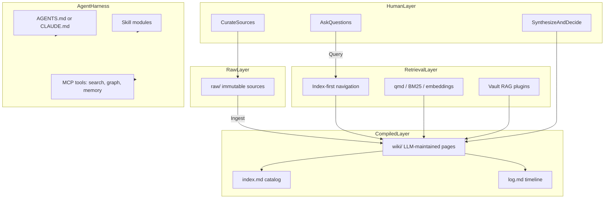
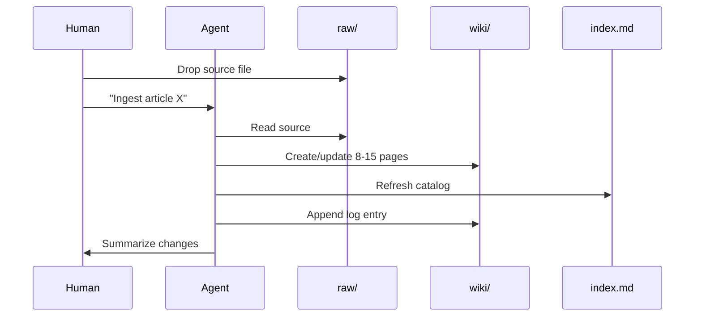
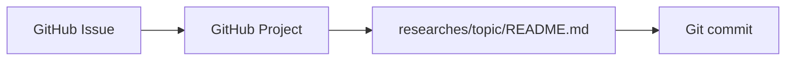
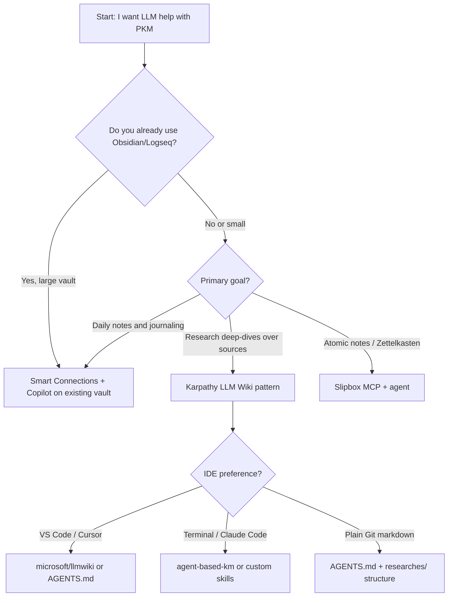

# LLM Harnessing for PKM

This page serves as a table of contents for research on using LLM agents to harness Personal Knowledge Management (PKM). Consider creating a [GitHub Issue](https://github.com/pomodorozhong/personal-research/issues) and Project board to track progress, mirroring the [git_and_github research](../git_and_github/README.md) workflow.

## Roadmaps

### Roadmap A — Conceptual foundations

-   [x] PKM vs RAG vs Wiki vs Memory taxonomy
-   [x] Karpathy LLM Wiki pattern deep read
-   [x] Synthesis-time vs query-time framework

### Roadmap B — Tool evaluation

-   [x] Obsidian plugin stack (Smart Connections, Copilot)
-   [x] Agent skill frameworks (logseq-wiki, agent-based-km)
-   [x] MCP memory servers (Slipbox, agent-knowledge)

### Roadmap C — Practical harness design

-   [ ] Schema file design (`AGENTS.md` conventions)
-   [ ] Ingest / query / lint workflow specification
-   [ ] Scaling triggers (when to add qmd/search)

### Roadmap D — Application to personal-research repo

-   [ ] Prototype `AGENTS.md` for this repo
-   [ ] Cross-topic `index.md`
-   [ ] Pilot: compile this LLM-PKM research into wiki format

---

## 1. Foundations

### What "LLM harnessing for PKM" means

"LLM harnessing" is not just chatting with an LLM about your notes. It is **choosing how an LLM agent participates in your knowledge lifecycle** — what it reads, what it writes, when synthesis happens, and how it is constrained between sessions.

Four paradigms are often confused. They must be kept distinct ([Glukhov: PKM vs RAG vs Wiki vs Memory](https://www.glukhov.org/knowledge-management/foundations/pkm-vs-rag-vs-wiki-vs-memory-systems/)):

| Layer | Who drives it | What it optimizes | PKM role |
| --- | --- | --- | --- |
| **PKM** | Human | Thinking, synthesis, reuse | Your notes, drafts, explorations |
| **Compiled Wiki** | LLM agent | Stable, interlinked reference | LLM-maintained markdown between you and raw sources |
| **RAG** | Machine | Query-time retrieval | Semantic search over vault at chat time |
| **Agent Memory** | AI agent | Cross-session continuity | Preferences, episodic facts, extracted entities |

**Core distinction:** PKM and wikis *structure* knowledge. RAG *retrieves* knowledge. Memory systems *evolve agent context* over time.

### The knowledge lifecycle

All knowledge systems touch some subset of these stages:

1. **Capture** — save sources, ideas, observations
2. **Structure** — organize, link, categorize
3. **Retrieval** — find relevant material when needed
4. **Interpretation** — synthesize, compare, decide
5. **Reuse** — apply knowledge in output (writing, decisions, code)
6. **Evolution** — update, deprecate, resolve contradictions

Different tools optimize different stages. Conflating them leads to bad architecture:

- **Wiki-as-dump** — personal scratch notes in a shared wiki with no owners
- **RAG-without-truth** — retrieval over fragmented, stale, or contradictory sources
- **Memory-as-database** — agent remembers everything with no governance or forgetting
- **PKM overload** — automation and agent maintenance on notes that were never meant to be canonical

### Mental model diagram



---

## 2. The LLM Wiki / Compiled Knowledge Pattern

The dominant new pattern in 2026 is [Andrej Karpathy's LLM Wiki gist](https://gist.github.com/karpathy/442a6bf555914893e9891c11519de94f). It shifts synthesis from **query time (RAG)** to **ingest time (compilation)**.

### The problem with query-time RAG for PKM

Most people's experience with LLMs and documents looks like RAG: upload files, retrieve relevant chunks at query time, generate an answer. NotebookLM, ChatGPT file uploads, and most RAG systems work this way.

The problem: **the LLM rediscovers knowledge from scratch on every question.** There is no accumulation. Ask a subtle question requiring synthesis across five documents, and the LLM must find and piece together fragments every time. Nothing is built up.

### The compiled wiki alternative

Instead of retrieving from raw documents at query time, the LLM **incrementally builds and maintains a persistent wiki** — a structured, interlinked collection of markdown files between you and your raw sources.

When you add a new source, the LLM does not just index it. It reads it, extracts key information, and integrates it into the existing wiki — updating entity pages, revising topic summaries, noting contradictions, strengthening the evolving synthesis. Knowledge is **compiled once and kept current**, not re-derived on every query.

> Obsidian is the IDE; the LLM is the programmer; the wiki is the codebase.

Karpathy relates this to Vannevar Bush's Memex (1945): a personal, curated knowledge store with associative trails. Bush's vision was private and actively curated, with connections between documents as valuable as the documents themselves. The part he could not solve was maintenance. The LLM handles that.

### Three-layer architecture

| Layer | Owner | Purpose |
| --- | --- | --- |
| **`raw/`** | Human | Immutable source documents — articles, papers, PDFs, transcripts. The LLM reads but never modifies these. |
| **`wiki/`** | LLM | Generated markdown — summaries, entity pages, concept pages, cross-references, derived answers. The LLM owns this layer. |
| **Schema** | Human + LLM | Conventions document (`AGENTS.md`, `CLAUDE.md`) defining structure, workflows, and rules. Co-evolved over time. |

Typical `wiki/` structure (varies by domain):

```
wiki/
├── concepts/       # frameworks, methods, terms
├── entities/       # people, organizations, tools
├── sources/        # one summary page per ingested source
├── synthesis/      # evolving thesis, overview
└── derived/        # query answers filed back into the wiki
```

### Core operations

#### Ingest

You drop a new source into `raw/` and tell the LLM to process it.

Example flow:

1. LLM reads the source
2. Discusses key takeaways with you (optional)
3. Writes a summary page in `wiki/sources/`
4. Updates relevant entity and concept pages (often 8–15 pages per source)
5. Updates `index.md`
6. Appends entry to `log.md`

You can ingest one source at a time with supervision, or batch-ingest with less oversight. Document your preferred workflow in the schema file.



#### Query

You ask questions against the wiki, not raw documents.

1. Agent reads `index.md` to find relevant pages
2. Reads those pages
3. Synthesizes answer with citations
4. Optionally files the answer into `wiki/derived/` so explorations compound

The retrieval target differs from RAG: you query **already-digested knowledge** — contradictions annotated, concepts cross-document synthesized, entity relations established.

Good answers can take many forms: markdown page, comparison table, slide deck (Marp), chart. The important insight is that valuable answers should not disappear into chat history.

#### Lint

Periodically, ask the LLM to health-check the wiki:

- Contradictions between pages
- Stale claims superseded by newer sources
- Orphan pages with no inbound links
- Important concepts mentioned but lacking their own page
- Missing cross-references
- Data gaps that could be filled with web search

The LLM can suggest new questions to investigate and new sources to seek. This keeps the wiki healthy as it grows.

### Special files

**`index.md`** — content-oriented catalog. Each page listed with a link, one-line summary, and optional metadata (date, source count). Organized by category. Updated on every ingest. At moderate scale (~100 sources, hundreds of pages), the agent reads the index first, then drills into relevant pages. This works surprisingly well without embedding infrastructure.

**`log.md`** — chronological, append-only audit trail of ingests, queries, and lint passes. Tip: use a consistent prefix like `## [2026-04-02] ingest | Article Title` so entries are grep-able.

---

## 3. Agent Harness Architecture

"Harnessing" means **constraining and operationalizing** the LLM for PKM — not just prompting it ad hoc.

### Harness components

| Component | Purpose | Examples |
| --- | --- | --- |
| **Schema / rules file** | Persistent agent instructions across sessions | `AGENTS.md`, `CLAUDE.md` |
| **Skills / commands** | Executable workflow modules with triggers and steps | `.claude/skills/`, `/ingest`, `/lint`, `/save` |
| **MCP servers** | Standardized tool protocol for search, graph, memory | qmd MCP, Slipbox, GraphMem, AKB |
| **Deterministic scripts** | Token-efficient routing, validation, ingest pipelines | Python routers (community pattern from gist comments) |
| **Subagents** | Isolate search from synthesis to preserve context window | Main agent orchestrates; subagent retrieves |

The schema file is the most critical piece. A vague schema produces vague wiki pages. A schema that defines page formats, contradiction handling, and when to split vs extend a page produces a wiki you can rely on.

### Skills pattern

Practitioners encode workflows as skill modules rather than repeating instructions each session. Each skill typically includes:

- Trigger conditions (when to run)
- Execution steps
- Output formats
- Edge case handling
- Reference templates in a `reference/` directory

Example from [Wenjie Xu's LLM personal wiki](https://blog.wenjiexu.site/en/posts/llm-personal-wiki/):

- `syncing-wiki` — daily entry point; composes detection + ingestion
- `detecting-resources-sync` — find new files in `raw/`
- `ingesting-resources` — process a source into wiki pages
- `querying-wiki` — answer from compiled knowledge
- `checking-wiki-health` — lint pass

Skills should be **composable**: run standalone or embedded in larger flows. Query results can be answered or backfilled as new wiki pages.

### Token economics

A recurring pain point (from gist comment threads): token burn comes not from reasoning but from **repeated context loading** — the agent re-reads `AGENTS.md`, `index.md`, manifests, and raw sources across short sessions.

Mitigations:

1. **Deterministic scripts** for intake, routing, validation — reserve the LLM for synthesis and judgment
2. **Compact routing files** instead of scanning the whole wiki
3. **Subagents for search** — main agent context reserved for orchestration
4. **Hot cache** — a small `hot.md` summarizing recent context ([agent-based-knowledge-management](https://github.com/philippsied/agent-based-knowledge-management))

### Reference implementations

| Project | Platform | Notes |
| --- | --- | --- |
| [microsoft/llmwiki](https://github.com/microsoft/llmwiki) | VS Code / Cursor | Extension with tree views, `@wiki` chat participant, MCP server, bulk ingest |
| [ystreibel/logseq-wiki](https://github.com/ystreibel/logseq-wiki) | Logseq | Skill-based framework; ingest → extract → resolve → evolve |
| [clonn/obsidian_plugin_LLM-Wiki](https://github.com/clonn/obsidian_plugin_LLM-Wiki) | Obsidian | Plugin + Python CLI; queue-based prompt bundles for Claude Code |
| [daje0601/Obsidian-RAG](https://github.com/daje0601/Obsidian-RAG) | Obsidian + Claude Code | Minimal: no vector DB; agent reads files directly via index hierarchy |
| [philippsied/agent-based-knowledge-management](https://github.com/philippsied/agent-based-knowledge-management) | Obsidian + Claude Code | 15 skills; contradiction callouts, 8-category lint, autoresearch loop |
| [arturseo-geo/llm-knowledge-base](https://github.com/arturseo-geo/llm-knowledge-base) | Tool-agnostic | Formalized schema + learning layer (FSRS flashcards, gap tracking, contamination mitigation) |
| [jamesfishwick/slipbox-mcp](https://github.com/jamesfishwick/zettelkasten-mcp) | MCP (any agent) | Zettelkasten-native; 19 tools, typed links, cluster detection |

---

## 4. Traditional PKM + LLM (Plugin / RAG-in-Vault)

For users who keep **human-written notes** and add AI on top, the 2026 Obsidian landscape offers a mature plugin stack. Users typically pair two or more specialized plugins.

### Obsidian AI plugin landscape (2026)

| Plugin | Role | RAG | Local LLM | Model |
| --- | --- | --- | --- | --- |
| [Smart Connections](https://smartconnections.app/) | Semantic search, related-notes sidebar | Yes | Local embeddings by default | Free core; optional Pro |
| [Copilot for Obsidian](https://github.com/logancyang/obsidian-copilot) | Vault QA chat, agents | Yes (Vault QA) | Ollama, LM Studio | BYOK free; Plus ~$15/mo |
| [Smart Composer](https://github.com/glowingjade/obsidian-smart-composer) | Cursor-style in-note editing | Yes | Ollama, LM Studio | Open source, BYOK |
| [Text Generator](https://github.com/nhaouari/obsidian-textgenerator-plugin) | Template-driven generation | No | Ollama, multi-provider | Open source, BYOK |
| [Companion](https://github.com/rizerphe/obsidian-companion) | Ghost text autocompletion | No | Ollama, OpenAI | Open source, BYOK |

**Recommended combo for most users:** Smart Connections (embedding/search layer) + Copilot (chat layer), both pointed at a local [Ollama](https://ollama.com/) backend for privacy.

- Embeddings: `nomic-embed-text` or `mxbai-embed-large`
- Chat: `llama3.2` or similar via `http://localhost:11434/v1`

### Plugin RAG vs compiled wiki

| Dimension | Plugin RAG (Obsidian stack) | Compiled Wiki (Karpathy pattern) |
| --- | --- | --- |
| Who writes notes | You | LLM (you curate sources) |
| When synthesis happens | Query time | Ingest time |
| Knowledge accumulation | Stateless per query | Compounds over time |
| Cross-references | Discovered ad hoc | Pre-built and maintained |
| Contradictions | May go unnoticed | Flagged during ingest/lint |
| Best for | Existing vaults, daily journaling | Research deep-dives, source corpora |

These are not mutually exclusive. You can maintain human-written daily notes in Obsidian while using an agent to compile a `wiki/` layer from `raw/` sources.

### Other PKM tools

- **Logseq** — [logseq-wiki](https://github.com/ystreibel/logseq-wiki) adapts the Karpathy pattern with block-based pages and namespace conventions
- **Notion / cloud PKM** — typically rely on API-connected agents or copy-export to markdown for agent workflows; less local-first
- **Plain markdown in Git** — natural fit for agent harnessing; version history and collaboration are free (this repo is an example)

---

## 5. MCP Memory Systems (Agent Continuity Layer)

Agent memory is **separate from PKM content**. Memory systems give agents persistent context across sessions — preferences, decisions, episodic facts — whereas PKM/wiki stores domain knowledge you can read and audit.

| System | Approach | PKM relevance |
| --- | --- | --- |
| [agent-knowledge](https://github.com/yucx-go/agent-knowledge) | Claim/evidence compilation, BM25 + graph, no vectors | Drop-in memory MCP for Claude Code / Cursor / Codex |
| [GraphMem-MCP](https://github.com/Sathvik-1007/graphmem-mcp) | Knowledge graph + semantic search, 28 tools | Per-project entity/decision memory for coding agents |
| [AKB](https://github.com/dnotitia/AKB) | Git-backed vault, hybrid search, URI graph | Team/org knowledge served over MCP |
| [Slipbox MCP](https://github.com/jamesfishwick/zettelkasten-mcp) | Zettelkasten-native, typed links, cluster detection | Active Zettelkasten partner with workflow prompts |

### Memory vs compiled wiki: when to use which

**Use a compiled wiki when:**

- Knowledge is domain content you want to read, browse, and link (research topics, book notes, competitive analysis)
- You need human-auditable markdown with git history
- Cross-references and synthesis across sources matter

**Use agent memory when:**

- The agent needs to remember *how you work* (preferences, past decisions, project context)
- Continuity across coding or research sessions matters
- Facts are agent-specific and should not pollute your readable wiki

**Use both (recommended):**

- Wiki = what you know about the world
- Memory = what the agent knows about working with you

Do not let memory replace a wiki. Memory lacks the structure, lint loop, and human readability that make PKM useful.

---

## 6. Synthesis-Time vs Query-Time Decision Framework

Based on [Ranjan Kumar's analysis](https://ranjankumar.in/llm-wiki-synthesis-time-decision-rag-agentic-memory): LLM Wiki and RAG are the same thing at **different synthesis times**. The real architectural question is: **when does synthesis happen — at ingest or at query?**

| Factor | Favor compiled wiki (ingest-time) | Favor RAG (query-time) |
| --- | --- | --- |
| Corpus size | Curated, under ~200 compiled pages | Thousands of raw docs, frequently changing |
| Query frequency | Same topics queried repeatedly | Ad-hoc one-off lookups |
| Human role | Curator + questioner | Author of notes |
| Auditability | High (readable markdown, git history) | Lower (vector store is opaque) |
| Privacy | Local markdown + local agent | Depends on plugin/API choices |
| Maintenance | Agent lint loop | Re-index on change |
| Output durability | Persistent wiki pages | Ephemeral chat responses |

### The compiler analogy

- **RAG** = interpreter: every query re-reads raw documents, re-derives relationships, re-synthesizes
- **Compiled wiki** = compiler: process sources once at ingest, store compiled output, query the output not the source

At scale, the irony is deliberate: compiled wikis add [qmd](https://github.com/tobi/qmd) (hybrid BM25 + vector + LLM rerank) for navigation — which *is* retrieval. The pattern that positioned itself as a RAG replacement quietly becomes RAG-augmented at scale.

### Hybrid recommendation (default best practice)

1. **PKM layer** — human exploratory notes, drafts, unfinished thinking
2. **Compiled wiki layer** — agent-maintained synthesis from `raw/` sources
3. **Search layer** — `index.md` first; add qmd/BM25 when scale demands
4. **Memory layer** — session continuity and user preferences only; not a substitute for wiki

---

## 7. Scaling Path and Failure Modes

### Growth curve

| Stage | Size | Navigation | Tools |
| --- | --- | --- | --- |
| **Small** | ~10–50 pages | `index.md` only | Schema file + agent |
| **Medium** | ~100–200 pages | Index + hybrid search | Add [qmd](https://github.com/tobi/qmd) (CLI + MCP) |
| **Large** | 200+ pages | Hierarchical indexes | Subagent search, deterministic routing scripts |
| **Enterprise** | 1000s of docs | Full RAG pipeline | Vector DB, access control, eval harness |

Karpathy reports running ~100 articles and ~400K words via index navigation. Research suggests quality degrades around 130K tokens ("lost in the middle"), so plan search tooling before you hit that wall.

### Failure modes

| Failure | Description | Mitigation |
| --- | --- | --- |
| **Wiki slop** | Agent-generated pages without curation; quality degrades over time | Human review on ingest; [contamination mitigation](https://github.com/arturseo-geo/llm-knowledge-base/blob/main/docs/contamination-mitigation.md) patterns; promotion gates from draft to canonical |
| **Index rot** | `index.md` out of sync with actual pages | Lint checks; update index on every ingest; deterministic validation scripts |
| **False compounding** | Hallucinated cross-refs that look authoritative | Require source attribution; contradiction callouts; periodic lint |
| **Context re-read tax** | Expensive sessions from loading full schema + index every time | Hot cache; compact routing files; subagents; deterministic pre-processing |
| **Over-collection** | PKM landfill — capture without synthesis | Optimize for reuse, not capture; regular lint for orphans and unused notes |
| **Stale wiki** | Compiled pages not updated when sources change | Re-ingest workflow; lint for stale claims; date metadata on pages |

---

## 8. Mapping to This Repo

This [personal-research](https://github.com/pomodorozhong/personal-research) repo is already a **minimal PKM system**:



Issues capture topics of interest. Projects arrange work in progress. Markdown in `researches/` stores findings worth keeping.

### Lightweight extension path (Roadmap D)

Without over-engineering, LLM harnessing could extend this workflow:

| Addition | Purpose |
| --- | --- |
| `researches/<topic>/raw/` | Source clips per research topic (articles, PDFs, transcripts) |
| `researches/<topic>/wiki/` | Agent-compiled synthesis pages (optional) |
| `researches/index.md` | Cross-topic catalog maintained by agent |
| `AGENTS.md` at repo root | Schema: ingest/query/lint conventions for Cursor or Claude Code |

This repo is a natural fit for the **plain-markdown + agent** approach. No Obsidian required. Git provides version history; the agent provides compilation and cross-linking.

Example agent commands (to define in `AGENTS.md`):

- `ingest researches/llm_harnessing_for_pkm/raw/<file>` — compile source into topic wiki
- `query <question>` — answer from compiled research, cite pages
- `lint researches/` — check for broken links, stale claims, missing cross-refs

---

## 9. Tool Landscape Comparison

| Approach | Setup cost | Privacy | Compounding | Human effort | Best for |
| --- | --- | --- | --- | --- | --- |
| NotebookLM / ChatGPT uploads | Low | Cloud | Low | Low | Quick exploration |
| Obsidian + Smart Connections + Copilot | Medium | Local option | Medium | Medium (you write notes) | Existing Obsidian users |
| Karpathy LLM Wiki + Claude Code | Medium | Local | High | Low (curator role) | Research deep-dives |
| microsoft/llmwiki VS Code ext | Medium | Local | High | Low | VS Code / Cursor users |
| Zettelkasten + Slipbox MCP | Medium | Local | High | Medium | Atomic-note thinkers |
| Plain markdown + agent (this repo) | Low | Local | High | Low–Medium | Git-native researchers |
| Full RAG stack (vector DB) | High | Configurable | Low | High | Production apps, 5000+ docs |

### Decision flowchart



---

## 10. Bibliography

### Primary sources

- [Karpathy llm-wiki gist](https://gist.github.com/karpathy/442a6bf555914893e9891c11519de94f) — the foundational pattern document
- [Glukhov: PKM vs RAG vs Wiki vs Memory](https://www.glukhov.org/knowledge-management/foundations/pkm-vs-rag-vs-wiki-vs-memory-systems/) — taxonomy and mental model
- [Ranjan Kumar: Synthesis-Time Decision](https://ranjankumar.in/llm-wiki-synthesis-time-decision-rag-agentic-memory) — when to compile vs retrieve

### Implementations

- [microsoft/llmwiki](https://github.com/microsoft/llmwiki) — VS Code extension + MCP
- [daje0601/Obsidian-RAG](https://github.com/daje0601/Obsidian-RAG) — minimal Obsidian + Claude Code
- [clonn/obsidian_plugin_LLM-Wiki](https://github.com/clonn/obsidian_plugin_LLM-Wiki) — Obsidian plugin + CLI
- [ystreibel/logseq-wiki](https://github.com/ystreibel/logseq-wiki) — Logseq skill framework
- [arturseo-geo/llm-knowledge-base](https://github.com/arturseo-geo/llm-knowledge-base) — formalized schema + learning layer
- [philippsied/agent-based-knowledge-management](https://github.com/philippsied/agent-based-knowledge-management) — 15 Claude skills for Obsidian

### MCP memory and Zettelkasten

- [jamesfishwick/slipbox-mcp](https://github.com/jamesfishwick/zettelkasten-mcp) — Zettelkasten MCP server
- [yucx-go/agent-knowledge](https://github.com/yucx-go/agent-knowledge) — claim/evidence memory MCP
- [Sathvik-1007/GraphMem-MCP](https://github.com/Sathvik-1007/graphmem-mcp) — knowledge graph MCP
- [dnotitia/AKB](https://github.com/dnotitia/AKB) — Git-backed agent knowledgebase

### Practitioner write-ups

- [Built a Self-Maintaining Personal Wiki (Wenjie Xu)](https://blog.wenjiexu.site/en/posts/llm-personal-wiki/) — skills-based workflow in production
- [Obsidian + AI plugin comparison (Code Culture)](https://codeculture.store/blogs/developer-culture/obsidian-ai-plugin-comparison-2025) — Smart Connections vs Copilot vs Claude Code
- [Obsidian Local AI 2026 (Local AI Master)](https://localaimaster.com/blog/local-ai-obsidian-integration) — Ollama setup guide
- [Karpathy LLM Wiki: compile knowledge (Z Engineer)](https://zengineer.blog/blog/tech/karpathy-llm-wiki-compile-knowledge-en/) — compiler analogy and scale limits
- [Obsidian Was Never the Problem (Drink Your OJ)](https://drinkyouroj.substack.com/p/obsidian-was-never-the-problem) — PKM tool vs agent maintenance bottleneck

### Search tooling

- [qmd](https://github.com/tobi/qmd) — local hybrid search for markdown (BM25 + vector + LLM rerank, MCP server)

---

## Summary

LLM harnessing for PKM is an architectural choice about **when and how an agent participates in your knowledge lifecycle**. The 2026 consensus centers on Karpathy's compiled wiki pattern — synthesis at ingest time, human as curator, agent as maintainer — with RAG and memory as complementary layers rather than replacements. For this repo, the lowest-friction path is plain markdown + `AGENTS.md` + optional `raw/`/`wiki/` folders per research topic, leaving Roadmap C and D as natural next steps.
