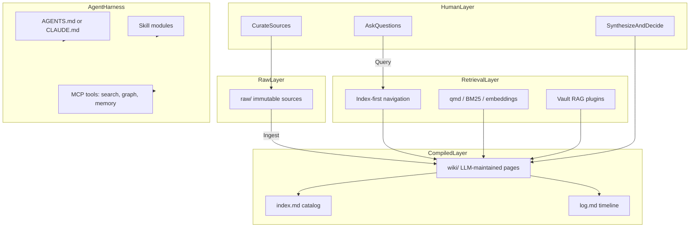

# Foundations

Back to [research index](./README.md)

## What "LLM harnessing for PKM" means

"LLM harnessing" is not just chatting with an LLM about your notes. It is **choosing how an LLM agent participates in your knowledge lifecycle** — what it reads, what it writes, when synthesis happens, and how it is constrained between sessions.

Four paradigms are often confused. They must be kept distinct ([Glukhov: PKM vs RAG vs Wiki vs Memory](https://www.glukhov.org/knowledge-management/foundations/pkm-vs-rag-vs-wiki-vs-memory-systems/)):

| Layer | Who drives it | What it optimizes | PKM role |
| --- | --- | --- | --- |
| **PKM** | Human | Thinking, synthesis, reuse | Your notes, drafts, explorations |
| **Compiled Wiki** | LLM agent | Stable, interlinked reference | LLM-maintained markdown between you and raw sources |
| **RAG** | Machine | Query-time retrieval | Semantic search over vault at chat time |
| **Agent Memory** | AI agent | Cross-session continuity | Preferences, episodic facts, extracted entities |

**Core distinction:** PKM and wikis *structure* knowledge. RAG *retrieves* knowledge. Memory systems *evolve agent context* over time.

## The knowledge lifecycle

All knowledge systems touch some subset of these stages:

1. **Capture** — save sources, ideas, observations
2. **Structure** — organize, link, categorize
3. **Retrieval** — find relevant material when needed
4. **Interpretation** — synthesize, compare, decide
5. **Reuse** — apply knowledge in output (writing, decisions, code)
6. **Evolution** — update, deprecate, resolve contradictions

Different tools optimize different stages. Conflating them leads to bad architecture:

- **Wiki-as-dump** — personal scratch notes in a shared wiki with no owners
- **RAG-without-truth** — retrieval over fragmented, stale, or contradictory sources
- **Memory-as-database** — agent remembers everything with no governance or forgetting
- **PKM overload** — automation and agent maintenance on notes that were never meant to be canonical

## Mental model diagram

## Related

- [LLM Wiki pattern](./llm_wiki_pattern.md)
- [Decision framework](./decision_framework.md)
- [Agent harness architecture](./agent_harness_architecture.md)
