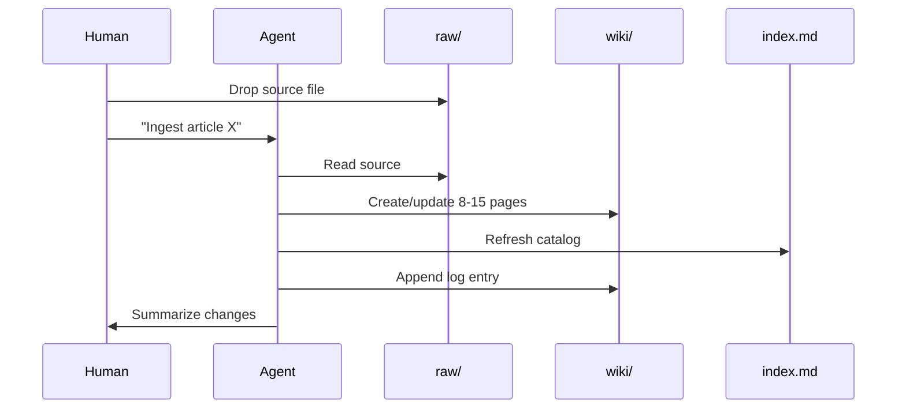

# LLM Wiki / Compiled Knowledge Pattern

Back to [research index](./README.md)

The dominant new pattern in 2026 is [Andrej Karpathy's LLM Wiki gist](https://gist.github.com/karpathy/442a6bf555914893e9891c11519de94f). It shifts synthesis from **query time (RAG)** to **ingest time (compilation)**.

## The problem with query-time RAG for PKM

Most people's experience with LLMs and documents looks like RAG: upload files, retrieve relevant chunks at query time, generate an answer. NotebookLM, ChatGPT file uploads, and most RAG systems work this way.

The problem: **the LLM rediscovers knowledge from scratch on every question.** There is no accumulation. Ask a subtle question requiring synthesis across five documents, and the LLM must find and piece together fragments every time. Nothing is built up.

## The compiled wiki alternative

Instead of retrieving from raw documents at query time, the LLM **incrementally builds and maintains a persistent wiki** — a structured, interlinked collection of markdown files between you and your raw sources.

When you add a new source, the LLM does not just index it. It reads it, extracts key information, and integrates it into the existing wiki — updating entity pages, revising topic summaries, noting contradictions, strengthening the evolving synthesis. Knowledge is **compiled once and kept current**, not re-derived on every query.

> Obsidian is the IDE; the LLM is the programmer; the wiki is the codebase.

Karpathy relates this to Vannevar Bush's Memex (1945): a personal, curated knowledge store with associative trails. Bush's vision was private and actively curated, with connections between documents as valuable as the documents themselves. The part he could not solve was maintenance. The LLM handles that.

## Three-layer architecture

| Layer | Owner | Purpose |
| --- | --- | --- |
| **`raw/`** | Human | Immutable source documents — articles, papers, PDFs, transcripts. The LLM reads but never modifies these. |
| **`wiki/`** | LLM | Generated markdown — summaries, entity pages, concept pages, cross-references, derived answers. The LLM owns this layer. |
| **Schema** | Human + LLM | Conventions document (`AGENTS.md`, `CLAUDE.md`) defining structure, workflows, and rules. Co-evolved over time. |

Typical `wiki/` structure (varies by domain):

```
wiki/
├── concepts/       # frameworks, methods, terms
├── entities/       # people, organizations, tools
├── sources/        # one summary page per ingested source
├── synthesis/      # evolving thesis, overview
└── derived/        # query answers filed back into the wiki
```

## Core operations

### Ingest

You drop a new source into `raw/` and tell the LLM to process it.

Example flow:

1. LLM reads the source
2. Discusses key takeaways with you (optional)
3. Writes a summary page in `wiki/sources/`
4. Updates relevant entity and concept pages (often 8–15 pages per source)
5. Updates `index.md`
6. Appends entry to `log.md`

You can ingest one source at a time with supervision, or batch-ingest with less oversight. Document your preferred workflow in the schema file.



### Query

You ask questions against the wiki, not raw documents.

1. Agent reads `index.md` to find relevant pages
2. Reads those pages
3. Synthesizes answer with citations
4. Optionally files the answer into `wiki/derived/` so explorations compound

The retrieval target differs from RAG: you query **already-digested knowledge** — contradictions annotated, concepts cross-document synthesized, entity relations established.

Good answers can take many forms: markdown page, comparison table, slide deck (Marp), chart. The important insight is that valuable answers should not disappear into chat history.

### Lint

Periodically, ask the LLM to health-check the wiki:

- Contradictions between pages
- Stale claims superseded by newer sources
- Orphan pages with no inbound links
- Important concepts mentioned but lacking their own page
- Missing cross-references
- Data gaps that could be filled with web search

The LLM can suggest new questions to investigate and new sources to seek. This keeps the wiki healthy as it grows.

## Special files

**`index.md`** — content-oriented catalog. Each page listed with a link, one-line summary, and optional metadata (date, source count). Organized by category. Updated on every ingest. At moderate scale (~100 sources, hundreds of pages), the agent reads the index first, then drills into relevant pages. This works surprisingly well without embedding infrastructure.

**`log.md`** — chronological, append-only audit trail of ingests, queries, and lint passes. Tip: use a consistent prefix like `## [2026-04-02] ingest | Article Title` so entries are grep-able.

## Related

- [Foundations](./foundations.md)
- [Agent harness architecture](./agent_harness_architecture.md)
- [Obsidian setup guide](./obsidian_setup_guide.md)
- [Harness POC](./poc/harness_poc.ipynb)
