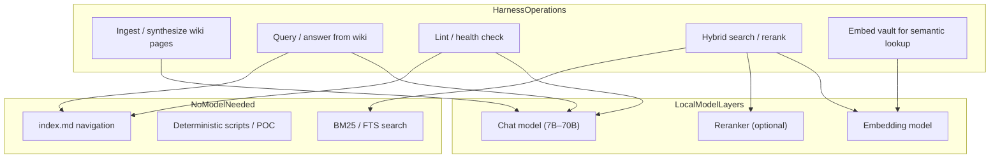
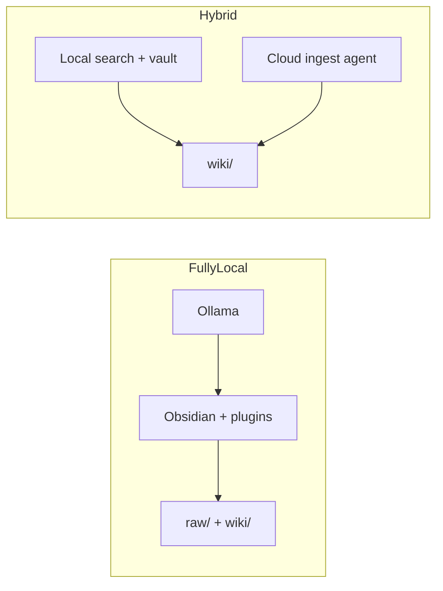
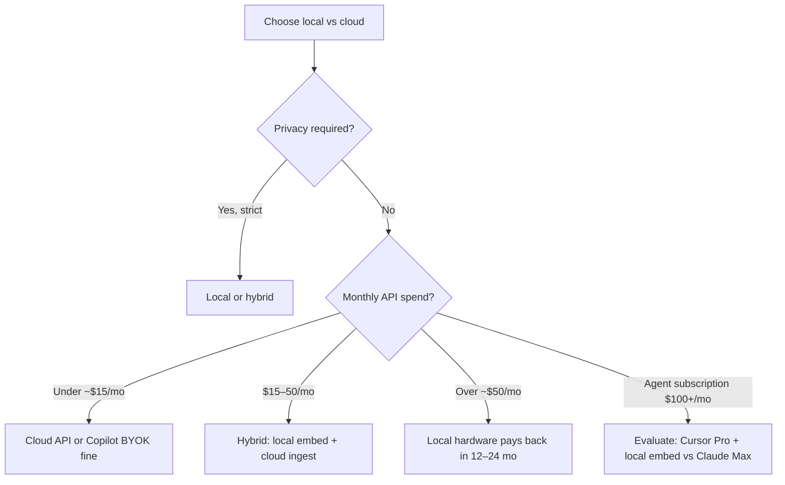

# Local Models in the Harness System

Back to [research index](./README.md)

Local models let you run parts (or all) of the PKM harness **on-device** — your notes, embeddings, and synthesis never leave your machine. This matters for private journals, work under NDA, health/finance notes, and anyone who wants predictable cost without API metering.

## Where local models fit in the harness

The harness is not one model call. Different steps have different requirements:



| Harness step | Local model needed? | Typical local stack |
| --- | --- | --- |
| **Index-first query** | No | Read `index.md` + wiki pages; agent or script only |
| **Ingest (compile wiki)** | Yes (for LLM synthesis) | Ollama chat model via OpenAI-compatible API |
| **Query (synthesize answer)** | Yes | Same chat model |
| **Lint (semantic checks)** | Partial | Dead links/orphans: no model; contradiction detection: chat model helps |
| **Vault semantic search** | Yes (embeddings) | `nomic-embed-text`, `mxbai-embed-large` via Ollama |
| **Hybrid search at scale** | Yes (embed + optional rerank) | [qmd](https://github.com/tobi/qmd) with local models |
| **Deterministic POC** | No | [harness.py](./poc/harness.py) — stdlib only |

**Key insight:** A large fraction of the harness (folder layout, `index.md`, `log.md`, link lint, BM25) runs without any model. Local models matter most for **ingest synthesis** and **semantic retrieval** when the wiki outgrows index navigation.

## Recommended local stack (2026)

### Runtime: Ollama

[Ollama](https://ollama.com/) is the default local backend. It exposes an **OpenAI-compatible API** at `http://localhost:11434/v1`, which most Obsidian plugins and many tools already support.

```bash
# Install Ollama, then pull models by role
ollama pull nomic-embed-text    # embeddings
ollama pull mxbai-embed-large   # alternative embeddings
ollama pull llama3.2            # general chat / synthesis (3B–8B tier)
ollama pull qwen2.5:7b          # strong 7B for longer synthesis
ollama pull qwen2.5:14b         # if hardware allows; better ingest quality
```

**Alternative:** [LM Studio](https://lmstudio.ai/) — same OpenAI-compatible pattern, GUI for model management, useful if you prefer manual model downloads.

### Model selection by task

| Task | Model tier | Examples | Notes |
| --- | --- | --- | --- |
| **Embeddings** | Small, fast | `nomic-embed-text`, `mxbai-embed-large` | Run once per note; cache in `.smart-env/` or plugin store |
| **Quick query / lint** | 3B–8B | `llama3.2`, `phi3`, `gemma2:2b` | Fast; may miss nuance on multi-doc synthesis |
| **Ingest / compile wiki** | 7B–14B+ | `qwen2.5:7b`, `llama3.1:8b`, `mistral-nemo` | Needs strong instruction-following and long context |
| **Deep synthesis** | 14B–70B | `qwen2.5:32b`, `llama3.3:70b` | Requires 32GB+ RAM or good GPU; best ingest quality |
| **Hybrid search rerank** | Small LLM | qmd's built-in reranker | Optional; BM25 alone works for many wikis |

Use **different models for different jobs** — embeddings model for search, larger model only when running ingest or complex query.

## Integration paths

### 1. Obsidian vault layer (plugin RAG)

Best for: human-written notes + local semantic search and chat.

| Plugin | Local config |
| --- | --- |
| **Smart Connections** | Local embeddings by default; point at Ollama embedding model |
| **Copilot for Obsidian** | Base URL: `http://localhost:11434/v1`, model: `llama3.2` or `qwen2.5:7b` |
| **Text Generator** | Ollama provider for template expansion |
| **Smart Composer** | Ollama for in-note editing |

See [Obsidian setup guide](./obsidian_setup_guide.md) Step 4 for plugin install and Ollama wiring.

This covers **query-time RAG over your vault**. It does not by itself implement the compiled-wiki ingest loop — pair it with an agent that writes `wiki/` (below).

### 2. Agent layer (compiled wiki maintainer)

Best for: Karpathy-style ingest / query / lint over `raw/` and `wiki/`.

| Agent | Local model support | Notes |
| --- | --- | --- |
| **Claude Code / Cursor** | Cloud by default | File editing agent; typically uses cloud APIs for synthesis |
| **Continue.dev + Ollama** | Yes | IDE agent with local model backend |
| **Ollama + custom scripts** | Yes | Call `http://localhost:11434/v1/chat/completions` from ingest scripts |
| **Obsidian Copilot + vault** | Yes | Local chat over vault; manual or semi-automated wiki updates |

**Practical local-first compiled wiki:**

1. **Obsidian** — browse wiki, graph view, clip sources to `raw/`
2. **Ollama** — local synthesis for ingest/query prompts
3. **Copilot or Continue** — run ingest/query against vault with local model
4. **Deterministic scripts** — [harness.py](./poc/harness.py) or qmd for index/search without cloud

For full agent file editing (touch 10–15 pages per ingest), cloud agents (Claude Code, Cursor) are still common; a **hybrid** setup uses local models for search/chat and cloud for heavy multi-file ingest is typical.

### 3. Search layer (scale without cloud)

When `index.md` is insufficient:

| Tool | Local? | Role |
| --- | --- | --- |
| **[qmd](https://github.com/tobi/qmd)** | Yes | BM25 + local embeddings + optional LLM rerank; MCP server for agents |
| **agent-knowledge** | Yes | BM25 + graph, zero vector dependencies |
| **Slipbox MCP** | Yes | SQLite FTS5 BM25 |
| **Smart Connections** | Yes | Vault-wide semantic index |

Add to `AGENTS.md` / `CLAUDE.md`:

```markdown
When index.md is insufficient, run: qmd search wiki "<query>"
Prefer local qmd (on-device) for private vaults.
```

### 4. Memory layer (agent continuity)

| System | Local? |
| --- | --- |
| [agent-knowledge](https://github.com/yucx-go/agent-knowledge) | Yes — pure Python, BM25 + graph, no embeddings required |
| [GraphMem-MCP](https://github.com/Sathvik-1007/graphmem-mcp) | Yes — local embeddings option |
| [Slipbox MCP](https://github.com/jamesfishwick/zettelkasten-mcp) | Yes — SQLite, no cloud |

See [MCP memory systems](./mcp_memory_systems.md).

## Hybrid architectures

Local-only is not all-or-nothing. Common patterns:

### Pattern A — Local read, cloud write

- **Local:** embeddings, semantic search, browsing, git
- **Cloud:** ingest agent (Claude Code / Cursor) for multi-file wiki compilation
- **Why:** Best ingest quality while keeping vault contents off embedding APIs

### Pattern B — Fully local

- **Local:** Ollama chat + embeddings, Copilot, qmd, Obsidian
- **Cloud:** none
- **Why:** Maximum privacy; accept weaker multi-doc synthesis on smaller models

### Pattern C — Local harness, no LLM

- **Local:** [harness POC](./poc/harness_poc.ipynb), index navigation, BM25/qmd
- **LLM:** optional, only for synthesis steps you trigger manually
- **Why:** Minimal setup; learn the harness mechanics first



## Hardware guidelines

| Setup | RAM | GPU | Comfortable models |
| --- | --- | --- | --- |
| **Laptop (16GB)** | 16 GB | Integrated / 8GB VRAM | Embeddings + 3B–8B chat |
| **Desktop (32GB)** | 32 GB | 12–24 GB VRAM | Embeddings + 7B–14B chat |
| **Workstation (64GB+)** | 64 GB+ | 24 GB+ VRAM | Embeddings + 32B+ for ingest |

Rules of thumb:

- Embeddings are cheap — always local for private vaults
- Ingest quality scales with model size; 7B is usable, 14B+ noticeably better for cross-page synthesis
- Keep embedding index on disk (Smart Connections `.smart-env/`, qmd index) to avoid re-embedding every session

## Configuration examples

### Ollama OpenAI-compatible endpoint

```bash
curl http://localhost:11434/v1/chat/completions \
  -H "Content-Type: application/json" \
  -d '{
    "model": "qwen2.5:7b",
    "messages": [{"role": "user", "content": "Summarize the key concepts in this article..."}]
  }'
```

### Copilot for Obsidian (local)

- **API provider:** OpenAI compatible
- **Base URL:** `http://localhost:11434/v1`
- **Model:** `llama3.2` or `qwen2.5:7b`
- **API key:** `ollama` (placeholder; Ollama ignores it)

### Schema snippet for local-first vault

Add to `CLAUDE.md` / `AGENTS.md`:

```markdown
## Local model policy

- Prefer Ollama at http://localhost:11434/v1 for all synthesis and embedding.
- Do not send vault contents to cloud APIs unless the user explicitly requests it.
- For ingest: use qwen2.5:7b or larger if available.
- For search: use qmd or Smart Connections local index before reading all pages.
- Deterministic lint (dead links, index drift) runs without a model.
```

## Tradeoffs: local vs cloud

| Dimension | Local models | Cloud models |
| --- | --- | --- |
| **Privacy** | Vault stays on device | Data sent to provider |
| **Cost** | Hardware upfront; no per-token | Subscription / API metering |
| **Ingest quality** | Depends on hardware; 7B adequate, 14B+ better | Frontier models best for multi-file synthesis |
| **Speed** | GPU-dependent; CPU inference is slow | Fast, scaled infrastructure |
| **Offline** | Works air-gapped | Requires network |
| **Agent file editing** | Weaker local IDE agents | Claude Code / Cursor excel here |

---

## Effectiveness by harness operation

Effectiveness here means: **does the approach produce usable, trustworthy PKM output for the task?** Not benchmark leaderboard scores — real harness workflows.

### Summary matrix

| Operation | No model | Local 7B–8B | Local 14B+ | Cloud frontier | Notes |
| --- | --- | --- | --- | --- | --- |
| **Index-first query** | ★★★★★ | — | — | — | Best ROI; works to ~100–200 pages |
| **BM25 / FTS search** | ★★★★☆ | — | — | — | [agent-knowledge](https://github.com/yucx-go/agent-knowledge), Slipbox, qmd BM25 |
| **Semantic search (embeddings)** | — | ★★★★☆ | ★★★★☆ | ★★★★★ | Local embed models match cloud for retrieval quality |
| **Simple vault Q&A** | — | ★★★☆☆ | ★★★★☆ | ★★★★★ | 7B fine for single-note questions |
| **Multi-doc synthesis query** | — | ★★☆☆☆ | ★★★☆☆ | ★★★★★ | Weakest local tier; cloud or 14B+ recommended |
| **Ingest (1 source → wiki)** | — | ★★★☆☆ | ★★★★☆ | ★★★★★ | 7B usable with supervision; misses subtle cross-refs |
| **Ingest (multi-file agent edit)** | — | ★★☆☆☆ | ★★★☆☆ | ★★★★★ | Local IDE agents weak at 10–15 file passes |
| **Lint (dead links, orphans)** | ★★★★★ | — | — | — | [harness.py](./poc/harness.py) — no model needed |
| **Lint (contradictions, stale claims)** | — | ★★☆☆☆ | ★★★☆☆ | ★★★★☆ | Requires reasoning over multiple pages |
| **Knowledge compounding** | ★★★★★ | ★★★★☆ | ★★★★☆ | ★★★★★ | Compiled wiki pattern; model tier affects page quality |

★ = poor · ★★★ = acceptable · ★★★★ = good · ★★★★★ = excellent

### Ingest effectiveness (compiled wiki)

Ingest is the **hardest** local task because it requires:

- Reading a long source (5–30K tokens)
- Mapping entities/concepts to existing wiki pages
- Writing or updating 8–15 files consistently
- Updating `index.md` and cross-links without hallucinating

| Model class | Typical behavior | Human oversight needed |
| --- | --- | --- |
| **7B (Q4 quant)** | Good summaries; misses nuance; occasional wrong wikilinks | Review every ingest; fix cross-refs manually |
| **14B (Q4/Q8)** | Reliable concept extraction; decent merge with existing pages | Spot-check; lint pass catches most issues |
| **32B+ local** | Near-cloud quality for personal research corpora | Periodic lint; occasional contradiction review |
| **Cloud (Claude Sonnet / GPT-4o)** | Strong multi-file edits; better contradiction awareness | Curator review; trust but verify |

**Practical finding:** Local 7B is **effective enough** for personal research if you ingest one source at a time and run lint after each batch. Local models become ** ineffective** for unattended batch ingest of dozens of sources — error compounding produces wiki slop faster than cloud.

### Query effectiveness

| Query type | Index-only (no model) | Local 7B + index | Cloud + compiled wiki |
| --- | --- | --- | --- |
| "What pages exist about X?" | Excellent | Overkill | Overkill |
| "Summarize what we know about X" | Poor (no synthesis) | Good | Excellent |
| "Compare A vs B across 5 sources" | Poor | Weak–acceptable | Excellent |
| "Find contradictions about X" | Poor | Weak | Good |

**Compiled wiki boosts local effectiveness:** querying pre-digested pages (not raw chunks) reduces the reasoning load on small models. A 7B model reading 3 compiled concept pages often matches a cloud model reading 20 raw RAG chunks.

### Search effectiveness: local vs cloud embeddings

For **retrieval** (not synthesis), local embeddings are highly effective:

| Method | Recall on personal vault | Cost per 10K notes | Privacy |
| --- | --- | --- | --- |
| **Local `nomic-embed-text`** | Very good for semantic similarity | ~$0 marginal (one-time compute) | Full |
| **OpenAI `text-embedding-3-small`** | Very good | ~$0.02–0.20 per full re-index | Cloud |
| **BM25 only (no vectors)** | Good for keyword/exact match | $0 | Full |
| **Hybrid (BM25 + local embed)** | Best overall | Low marginal | Full |

Smart Connections reports usable semantic search on 10,000+ notes locally. For PKM harnessing, **local embeddings are the highest-effectiveness, lowest-cost layer** — enable them before upgrading chat models.

### Effectiveness of alternatives (same privacy tier)

When staying local-only, how do approaches compare for **overall PKM outcomes**?

| Approach | Compounding | Synthesis quality | Maintenance burden | Effective for |
| --- | --- | --- | --- | --- |
| **Compiled wiki + local 14B** | Highest | Good | Low (agent + lint) | Research deep-dives |
| **Compiled wiki + local 7B + human review** | High | Acceptable | Medium | Budget hardware |
| **Plugin RAG (SC + Copilot local)** | Low | Acceptable per query | Medium (you write notes) | Daily notes + lookup |
| **Index + BM25 only, no chat model** | Medium | None (no synthesis) | Low | Read-heavy archives |
| **Hybrid: local search + cloud ingest** | Highest | Excellent | Low | Best quality/privacy balance |

---

## Cost analysis

Costs below are **order-of-magnitude estimates** (2025–2026 pricing). Adjust for your hardware, electricity rates, and API plan.

### Cost dimensions

| Cost type | Local | Cloud |
| --- | --- | --- |
| **Upfront** | GPU, RAM upgrades, or new machine | None |
| **Recurring (money)** | Electricity (~$5–30/mo if running daily) | API tokens, subscriptions |
| **Recurring (time)** | Model tuning, slow inference, fixing bad ingests | Lower per-operation time |
| **Hidden** | Re-embedding vault on sync; failed ingest redo | Context re-read tax; data egress |

### Upfront hardware (local)

| Tier | Example hardware | Approx. cost | Comfortable stack |
| --- | --- | --- | --- |
| **Minimum** | Existing 16GB laptop, CPU inference | $0 extra | Embeddings + 3B–7B (slow chat) |
| **Sweet spot** | 32GB RAM + RTX 4060 16GB / M2 Pro 32GB | $800–1,500 (upgrade or used GPU) | Embeddings + 7B–14B fast |
| **Enthusiast** | 64GB + RTX 4090 24GB / M2 Ultra | $2,500–4,000+ | Embeddings + 32B ingest |

Amortize over 24 months: a $1,200 GPU upgrade ≈ **$50/month** — compare to heavy API usage below.

### Cloud cost reference (PKM-scale usage)

Typical PKM harness workloads (personal research, not production RAG):

| Service | Pricing model | Light use (~5 ingests + 20 queries/mo) | Medium (~20 ingests + 100 queries/mo) | Heavy (daily ingest + agent sessions) |
| --- | --- | --- | --- | --- |
| **Claude API (Sonnet)** | ~$3/$15 per MTok in/out | $2–8/mo | $15–40/mo | $80–200+/mo |
| **OpenAI API (GPT-4o)** | ~$2.50/$10 per MTok | $2–6/mo | $12–35/mo | $60–150+/mo |
| **Cursor Pro** | ~$20/mo flat | $20/mo | $20/mo | $20–40/mo |
| **Claude Code (Max)** | ~$100–200/mo | Subscription | Subscription | Subscription |
| **Copilot Obsidian Plus** | ~$15/mo | $15/mo | $15/mo | $15/mo |
| **NotebookLM** | Free tier | $0 | $0 | $0 |

**Ingest is expensive in tokens:** one supervised ingest (read 8K-token source, write 10 pages, update index) might consume 50K–150K input + 10K–30K output tokens. At Sonnet pricing, that's **~$0.30–1.50 per ingest**. Twenty ingests/month ≈ $6–30 in API cost alone, before agent overhead.

**Query is cheaper** if using compiled wiki (read index + 3 pages ≈ 5K–15K input tokens ≈ $0.02–0.10 per query).

### Local operating cost

| Activity | Energy / time cost (GPU machine) |
| --- | --- |
| Embed 10,000 notes (one-time) | ~2–10 min GPU; negligible electricity |
| Single 7B query (500 tokens out) | ~2–10 sec; ~$0.001 electricity |
| Single ingest (full source compile) | ~1–5 min; ~$0.01–0.05 electricity |
| Leave Ollama idle | Near zero |

Local inference **marginal cost per operation** is effectively zero after hardware is owned. The trade is **latency and your time** waiting for CPU/GPU.

### Break-even scenarios



| Profile | Estimated monthly cloud cost | Local break-even |
| --- | --- | --- |
| **Casual** (weekly query, rare ingest) | $0–5 | Local not worth hardware investment; use index-only + free tier |
| **Active researcher** (4 ingests/week, daily query) | $20–60 | Hybrid wins; local embeddings by month 1 |
| **Power user** (daily agent ingest, lint, autoresearch) | $100–250+ | Local 14B+ rig pays back in 6–18 months |
| **Privacy-first any volume** | N/A (won't use cloud) | Local from day 1; accept quality/time tradeoffs |

### Total cost of ownership (12-month, medium researcher)

Illustrative: 15 ingests + 80 queries/month, compiled wiki workflow.

| Stack | Year-1 cost | Notes |
| --- | --- | --- |
| **Cloud only** (Cursor Pro + API overage) | ~$360–600 | Best ingest quality; vault in cloud agent context |
| **Hybrid** (local Ollama embed + Cursor cloud ingest) | ~$240–400 + $0 hardware if existing PC | Best balance for most |
| **Local only** (existing 32GB + GPU) | ~$60–120 electricity | Good quality at 14B; slower agent editing |
| **Local only** (new $1,200 GPU upgrade) | ~$1,260–1,320 | Break-even vs cloud in ~2–3 years at medium use |
| **No LLM** (index + harness POC + BM25) | $0 | No synthesis; highest manual effort |

### Cost optimization strategies

1. **Always local: embeddings** — zero marginal cost; biggest retrieval bang for buck
2. **Index-first query** — avoid LLM calls when grep/index suffices
3. **Deterministic lint first** — [harness.py](./poc/harness.py) catches structural issues without tokens
4. **Cloud only for ingest** — reserve paid tokens for multi-file compilation, not search
5. **Batch embed overnight** — don't re-embed on every session
6. **Smaller model for lint/chat, larger for ingest** — swap Ollama models per task
7. **Compiled wiki reduces query cost** — pre-digested pages = fewer tokens per answer vs raw RAG

---

## Comparison vs alternatives

### Master comparison: local harness vs other PKM+AI stacks

| Stack | Privacy | Year-1 cost (medium user) | Ingest quality | Query quality | Compounding | Setup complexity |
| --- | --- | --- | --- | --- | --- | --- |
| **Local compiled wiki (Ollama 14B)** | ★★★★★ | Low–medium | ★★★★ | ★★★★ | ★★★★★ | Medium |
| **Local compiled wiki (Ollama 7B)** | ★★★★★ | Low | ★★★ | ★★★ | ★★★★★ | Medium |
| **Hybrid: local embed + cloud ingest** | ★★★★ | Medium | ★★★★★ | ★★★★★ | ★★★★★ | Medium |
| **Cloud compiled wiki (Claude Code)** | ★★★ | Medium–high | ★★★★★ | ★★★★★ | ★★★★★ | Low |
| **Obsidian SC + Copilot (local Ollama)** | ★★★★★ | Low | N/A (you write) | ★★★★ | ★★★ | Medium |
| **Obsidian SC + Copilot (cloud API)** | ★★ | Medium | N/A | ★★★★★ | ★★★ | Medium |
| **NotebookLM / ChatGPT uploads** | ★★ | Low ($0–20) | ★★★ | ★★★★ | ★★ | Very low |
| **Full cloud RAG (vector DB + API)** | ★★★ | High | ★★★ | ★★★★ | ★★ | High |
| **Index + BM25 only (no chat model)** | ★★★★★ | Very low | N/A | ★★ | ★★★★ | Low |

### Local vs cloud: same harness pattern

Same Karpathy compiled-wiki architecture, different model backend:

| Dimension | Local Ollama | Cloud API (Sonnet/GPT-4o) |
| --- | --- | --- |
| **Vault leaves device** | Never (if configured correctly) | Source content in API requests |
| **Multi-file ingest** | Manual/semi-automated; weak agent tooling | Claude Code / Cursor excel |
| **Per-ingest cost** | ~$0.01 electricity | ~$0.30–1.50 tokens |
| **Per-query cost** | ~$0.001 | ~$0.02–0.10 |
| **Latency (7B GPU)** | 2–15 sec/query | 1–5 sec/query |
| **Latency (CPU only)** | 30–120 sec/query | 1–5 sec/query |
| **Offline** | Yes | No |
| **Model updates** | Pull new Ollama models | Automatic via provider |
| **Best for** | Private vaults, predictable volume | Quality-critical ingest, agent automation |

**Verdict:** Cloud wins on **agent automation and ingest quality per hour of your time**. Local wins on **privacy, marginal cost at scale, and offline access**.

### Local compiled wiki vs local plugin RAG

Both can run fully on Ollama. Different architecture:

| Dimension | Local compiled wiki | Local plugin RAG (SC + Copilot) |
| --- | --- | --- |
| **Who writes notes** | LLM compiles `wiki/` | You write; LLM retrieves |
| **When model runs** | Ingest + query | Query only |
| **Tokens per repeated question** | Low (read compiled pages) | Medium–high (re-retrieve chunks) |
| **Cross-references** | Pre-built at ingest | Ad hoc at query |
| **Local model load** | Heavy at ingest, light at query | Light per query; embed once |
| **Effective without cloud** | Yes, with 14B+ or supervised 7B | Yes, 7B sufficient for Q&A |
| **Human effort** | Curate sources | Write and maintain notes |

**Verdict:** Plugin RAG is **more effective** if you already have a large human-written vault and mainly need lookup. Compiled wiki is **more effective** if you ingest many external sources and want compounding synthesis without writing every note yourself.

### Local vs NotebookLM / ChatGPT file uploads

| Dimension | Local harness | NotebookLM / ChatGPT uploads |
| --- | --- | --- |
| **Data residency** | Your disk | Google/OpenAI cloud |
| **Persistence** | Git-backed markdown wiki | Session/notebook scoped |
| **Compounding** | Wiki grows; cross-links maintained | Re-upload or re-index; no real wiki |
| **Cost** | Hardware | Free–$20/mo |
| **Setup** | Hours | Minutes |
| **Multi-source synthesis** | Good (compiled) | Good (RAG at query) |
| **Auditability** | Full (read every wiki page) | Low (black box) |

**Verdict:** NotebookLM is **more effective for quick exploration** of a few documents. Local harness is **more effective for long-running research** over months where knowledge must compound and stay under your control.

### Local vs full vector-database RAG

| Dimension | Local Ollama + markdown | Pinecone/Qdrant + cloud embed + API |
| --- | --- | --- |
| **Setup** | Ollama + Obsidian or agent | Days; infra + chunking pipeline |
| **Year-1 cost (personal scale)** | $0–1,500 (hardware) | $200–800+ (hosting + API) |
| **Scale ceiling** | ~500–2K docs comfortable | 10K+ docs |
| **Human-readable KB** | Yes (wiki is the artifact) | No (vectors are opaque) |
| **Local/offline** | Yes | Usually no |
| **PKM fit** | Excellent | Overkill for personal use |

**Verdict:** Full vector RAG is **not more effective for personal PKM** at typical vault sizes (<2K notes). It is **more effective for production apps** with many users and constantly changing corpora.

### Hybrid patterns ranked (effectiveness × cost)

For a medium researcher wanting good outcomes without overspending:

| Rank | Pattern | Why |
| --- | --- | --- |
| 1 | **Local embed + index + cloud ingest agent** | Best quality/cost; vault search never hits cloud |
| 2 | **Local 14B compiled wiki + supervised ingest** | Fully private; good if you have GPU |
| 3 | **Local 7B + heavy lint + human review** | Budget hardware; works with discipline |
| 4 | **Local plugin RAG only** | Fine for lookup; no compounding |
| 5 | **Cloud-only Claude Code wiki** | Easiest setup; ongoing subscription |
| 6 | **Fully local 7B unattended batch ingest** | Poor effectiveness; wiki slop risk |

### When local is the wrong choice

Local models are **less effective** than alternatives when:

- You need **unattended multi-file agent editing** and don't have 14B+ local or hybrid cloud ingest
- Your corpus is **10K+ frequently changing docs** (production RAG wins)
- You want **zero setup** and accept cloud privacy (NotebookLM, ChatGPT)
- You're on **16GB RAM CPU-only** and expect fast ingest (cloud or patience required)
- **Contradiction detection and lint** must be highly reliable without human review (cloud reasoning models win)

Local models are **the right choice** when:

- Vault content is ** sensitive** (health, legal, journal, NDA work)
- You ingest/query **regularly enough** that API costs exceed ~$30–50/mo
- You want **git-auditable markdown** with offline access
- You can **supervise ingest** or run 14B+ locally
- Embeddings and search can be local even if ingest uses cloud (hybrid)

---

## Failure modes (local-specific)

| Problem | Mitigation |
| --- | --- |
| **Model too small for ingest** | Use hybrid (cloud ingest); or step up to 14B+; or ingest one source at a time with human review |
| **Slow embedding of large vault** | Batch overnight; exclude folders in plugin settings; cache indexes |
| **Context overflow** | Index-first navigation; qmd retrieval; don't load entire vault into prompt |
| **Inconsistent local API** | Standardize on Ollama OpenAI-compatible endpoint; one config across plugins |
| **GPU OOM** | Use smaller quant (Q4); run chat and embed models sequentially, not concurrently |

## Related

- [Traditional PKM + LLM (plugins)](./traditional_pkm_and_llm.md)
- [Obsidian setup guide](./obsidian_setup_guide.md)
- [Agent harness architecture](./agent_harness_architecture.md)
- [Scaling & failure modes](./scaling_and_failure_modes.md)
- [Tool landscape comparison](./tool_landscape.md)
- [Bibliography — Obsidian Local AI](./bibliography.md)
