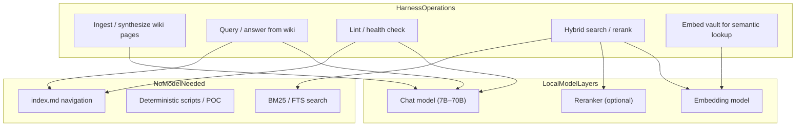
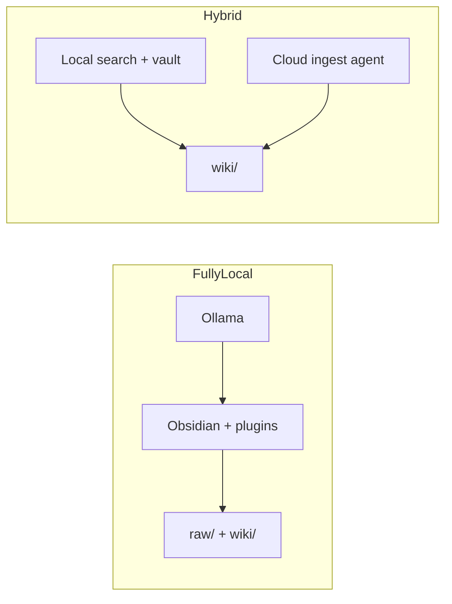

# How to Use Local Models in the Harness

Back to [research index](./README.md) · [Why use local models](./local_models_why.md)

This document covers **setup and operation**: where local models plug into the harness, recommended stack, integration paths, configuration, and troubleshooting.

For effectiveness, cost analysis, and comparisons to alternatives, see [local_models_why.md](./local_models_why.md).

## Where local models fit in the harness

The harness is not one model call. Different steps have different requirements:



| Harness step | Local model needed? | Typical local stack |
| --- | --- | --- |
| **Index-first query** | No | Read `index.md` + wiki pages; agent or script only |
| **Ingest (compile wiki)** | Yes (for LLM synthesis) | Ollama chat model via OpenAI-compatible API |
| **Query (synthesize answer)** | Yes | Same chat model |
| **Lint (semantic checks)** | Partial | Dead links/orphans: no model; contradiction detection: chat model helps |
| **Vault semantic search** | Yes (embeddings) | `nomic-embed-text`, `mxbai-embed-large` via Ollama |
| **Hybrid search at scale** | Yes (embed + optional rerank) | [qmd](https://github.com/tobi/qmd) with local models |
| **Deterministic lint** | No | Regex/index checks in [harness POC](./poc/harness_poc.ipynb) |

**Key insight:** A large fraction of the harness (folder layout, `index.md`, `log.md`, link lint, BM25) runs without any model. Local models matter most for **ingest synthesis** and **semantic retrieval** when the wiki outgrows index navigation.

## Recommended local stack (2026)

### Runtime: Ollama

[Ollama](https://ollama.com/) is the default local backend. It exposes an **OpenAI-compatible API** at `http://localhost:11434/v1`, which most Obsidian plugins and many tools already support.

```bash
# Install Ollama, then pull models by role
ollama pull nomic-embed-text    # embeddings
ollama pull mxbai-embed-large   # alternative embeddings
ollama pull llama3.2            # general chat / synthesis (3B–8B tier)
ollama pull qwen2.5:7b          # strong 7B for longer synthesis
ollama pull qwen2.5:14b         # if hardware allows; better ingest quality
```

**Alternative:** [LM Studio](https://lmstudio.ai/) — same OpenAI-compatible pattern, GUI for model management, useful if you prefer manual model downloads.

### Model selection by task

| Task | Model tier | Examples | Notes |
| --- | --- | --- | --- |
| **Embeddings** | Small, fast | `nomic-embed-text`, `mxbai-embed-large` | Run once per note; cache in `.smart-env/` or plugin store |
| **Quick query / lint** | 3B–8B | `llama3.2`, `phi3`, `gemma2:2b` | Fast; may miss nuance on multi-doc synthesis |
| **Ingest / compile wiki** | 7B–14B+ | `qwen2.5:7b`, `llama3.1:8b`, `mistral-nemo` | Needs strong instruction-following and long context |
| **Deep synthesis** | 14B–70B | `qwen2.5:32b`, `llama3.3:70b` | Requires 32GB+ RAM or good GPU; best ingest quality |
| **Hybrid search rerank** | Small LLM | qmd's built-in reranker | Optional; BM25 alone works for many wikis |

Use **different models for different jobs** — embeddings model for search, larger model only when running ingest or complex query.

## Integration paths

### 1. Obsidian vault layer (plugin RAG)

Best for: human-written notes + local semantic search and chat.

| Plugin | Local config |
| --- | --- |
| **Smart Connections** | Local embeddings by default; point at Ollama embedding model |
| **Copilot for Obsidian** | Base URL: `http://localhost:11434/v1`, model: `llama3.2` or `qwen2.5:7b` |
| **Text Generator** | Ollama provider for template expansion |
| **Smart Composer** | Ollama for in-note editing |

See [Obsidian setup guide](./obsidian_setup_guide.md) Step 4 for plugin install and Ollama wiring.

This covers **query-time RAG over your vault**. It does not by itself implement the compiled-wiki ingest loop — pair it with an agent that writes `wiki/` (below).

### 2. Agent layer (compiled wiki maintainer)

Best for: Karpathy-style ingest / query / lint over `raw/` and `wiki/`.

| Agent | Local model support | Notes |
| --- | --- | --- |
| **Claude Code / Cursor** | Cloud by default | File editing agent; typically uses cloud APIs for synthesis |
| **Continue.dev + Ollama** | Yes | IDE agent with local model backend |
| **Ollama + custom scripts** | Yes | Call `http://localhost:11434/v1/chat/completions` from ingest scripts |
| **Obsidian Copilot + vault** | Yes | Local chat over vault; manual or semi-automated wiki updates |

**Practical local-first compiled wiki:**

1. **Obsidian** — browse wiki, graph view, clip sources to `raw/`
2. **Ollama** — local synthesis for ingest/query prompts
3. **Copilot or Continue** — run ingest/query against vault with local model
4. **Deterministic lint** — [harness POC](./poc/harness_poc.ipynb) for index/link checks without cloud

For full agent file editing (touch 10–15 pages per ingest), cloud agents (Claude Code, Cursor) are still common; a **hybrid** setup uses local models for search/chat and cloud for heavy multi-file ingest. See [why doc — hybrid patterns](./local_models_why.md#hybrid-patterns-ranked-effectiveness--cost).

### 3. Search layer (scale without cloud)

When `index.md` is insufficient:

| Tool | Local? | Role |
| --- | --- | --- |
| **[qmd](https://github.com/tobi/qmd)** | Yes | BM25 + local embeddings + optional LLM rerank; MCP server for agents |
| **agent-knowledge** | Yes | BM25 + graph, zero vector dependencies |
| **Slipbox MCP** | Yes | SQLite FTS5 BM25 |
| **Smart Connections** | Yes | Vault-wide semantic index |

Add to `AGENTS.md` / `CLAUDE.md`:

```markdown
When index.md is insufficient, run: qmd search wiki "<query>"
Prefer local qmd (on-device) for private vaults.
```

### 4. Memory layer (agent continuity)

| System | Local? |
| --- | --- |
| [agent-knowledge](https://github.com/yucx-go/agent-knowledge) | Yes — pure Python, BM25 + graph, no embeddings required |
| [GraphMem-MCP](https://github.com/Sathvik-1007/graphmem-mcp) | Yes — local embeddings option |
| [Slipbox MCP](https://github.com/jamesfishwick/zettelkasten-mcp) | Yes — SQLite, no cloud |

See [MCP memory systems](./mcp_memory_systems.md).

## Hybrid deployment patterns

How to wire local and cloud components together:

### Pattern A — Local read, cloud write

- **Local:** embeddings, semantic search, browsing, git
- **Cloud:** ingest agent (Claude Code / Cursor) for multi-file wiki compilation

### Pattern B — Fully local

- **Local:** Ollama chat + embeddings, Copilot, qmd, Obsidian
- **Cloud:** none

### Pattern C — Local harness, no LLM

- **Local:** [harness POC](./poc/harness_poc.ipynb), index navigation, BM25/qmd
- **LLM:** optional, only for synthesis steps you trigger manually



## Hardware guidelines

| Setup | RAM | GPU | Comfortable models |
| --- | --- | --- | --- |
| **Laptop (16GB)** | 16 GB | Integrated / 8GB VRAM | Embeddings + 3B–8B chat |
| **Desktop (32GB)** | 32 GB | 12–24 GB VRAM | Embeddings + 7B–14B chat |
| **Workstation (64GB+)** | 64 GB+ | 24 GB+ VRAM | Embeddings + 32B+ for ingest |

Rules of thumb:

- Embeddings are cheap — always local for private vaults
- Ingest quality scales with model size; 7B is usable, 14B+ noticeably better for cross-page synthesis
- Keep embedding index on disk (Smart Connections `.smart-env/`, qmd index) to avoid re-embedding every session

## Configuration examples

### Ollama OpenAI-compatible endpoint

```bash
curl http://localhost:11434/v1/chat/completions \
  -H "Content-Type: application/json" \
  -d '{
    "model": "qwen2.5:7b",
    "messages": [{"role": "user", "content": "Summarize the key concepts in this article..."}]
  }'
```

### Copilot for Obsidian (local)

- **API provider:** OpenAI compatible
- **Base URL:** `http://localhost:11434/v1`
- **Model:** `llama3.2` or `qwen2.5:7b`
- **API key:** `ollama` (placeholder; Ollama ignores it)

### Schema snippet for local-first vault

Add to `CLAUDE.md` / `AGENTS.md`:

```markdown
## Local model policy

- Prefer Ollama at http://localhost:11434/v1 for all synthesis and embedding.
- Do not send vault contents to cloud APIs unless the user explicitly requests it.
- For ingest: use qwen2.5:7b or larger if available.
- For search: use qmd or Smart Connections local index before reading all pages.
- Deterministic lint (dead links, index drift) runs without a model.
```

## Failure modes and mitigations

| Problem | Mitigation |
| --- | --- |
| **Model too small for ingest** | Use hybrid (cloud ingest); or step up to 14B+; or ingest one source at a time with human review |
| **Slow embedding of large vault** | Batch overnight; exclude folders in plugin settings; cache indexes |
| **Context overflow** | Index-first navigation; qmd retrieval; don't load entire vault into prompt |
| **Inconsistent local API** | Standardize on Ollama OpenAI-compatible endpoint; one config across plugins |
| **GPU OOM** | Use smaller quant (Q4); run chat and embed models sequentially, not concurrently |

## Related

- [Why use local models](./local_models_why.md)
- [Obsidian setup guide](./obsidian_setup_guide.md)
- [Agent harness architecture](./agent_harness_architecture.md)
- [Scaling & failure modes](./scaling_and_failure_modes.md)
- [Traditional PKM + LLM (plugins)](./traditional_pkm_and_llm.md)
