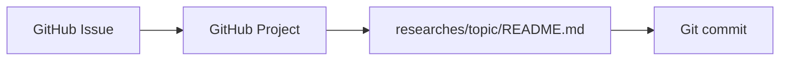

# Mapping to This Repo

Back to [research index](./README.md)

This [personal-research](https://github.com/pomodorozhong/personal-research) repo is already a **minimal PKM system**:

Issues capture topics of interest. Projects arrange work in progress. Markdown in `researches/` stores findings worth keeping.

## Lightweight extension path (Roadmap D)

Without over-engineering, LLM harnessing could extend this workflow:

| Addition | Purpose |
| --- | --- |
| `researches/<topic>/raw/` | Source clips per research topic (articles, PDFs, transcripts) |
| `researches/<topic>/wiki/` | Agent-compiled synthesis pages (optional) |
| `researches/index.md` | Cross-topic catalog maintained by agent |
| `AGENTS.md` at repo root | Schema: ingest/query/lint conventions for Cursor or Claude Code |

This repo is a natural fit for the **plain-markdown + agent** approach. No Obsidian required. Git provides version history; the agent provides compilation and cross-linking.

## Example agent commands

To define in `AGENTS.md`:

- `ingest researches/llm_harnessing_for_pkm/raw/<file>` — compile source into topic wiki
- `query <question>` — answer from compiled research, cite pages
- `lint researches/` — check for broken links, stale claims, missing cross-refs

## Roadmap D tasks

-   [ ] Prototype `AGENTS.md` for this repo
-   [ ] Cross-topic `index.md`
-   [ ] Pilot: compile this LLM-PKM research into wiki format

## Related

- [Research index](./README.md)
- [LLM Wiki pattern](./llm_wiki_pattern.md)
- [Harness POC](./poc/harness_poc.ipynb)
