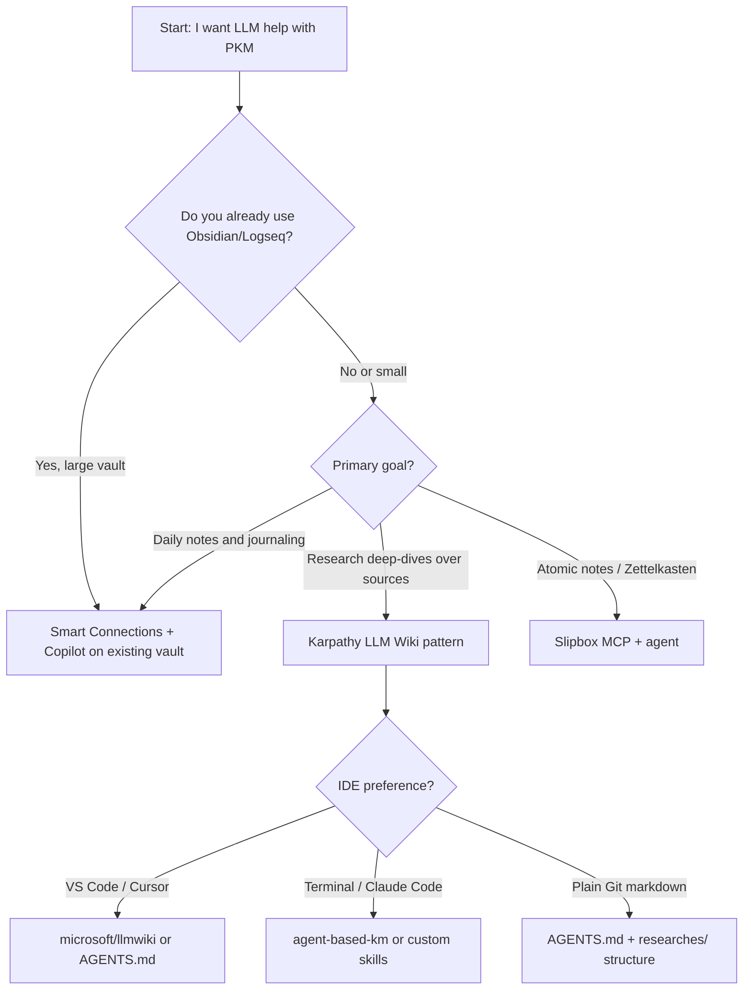

# Tool Landscape Comparison

Back to [research index](./README.md)

## Comparison matrix

| Approach | Setup cost | Privacy | Compounding | Human effort | Best for |
| --- | --- | --- | --- | --- | --- |
| NotebookLM / ChatGPT uploads | Low | Cloud | Low | Low | Quick exploration |
| Obsidian + Smart Connections + Copilot | Medium | Local option | Medium | Medium (you write notes) | Existing Obsidian users |
| Karpathy LLM Wiki + Claude Code | Medium | Local | High | Low (curator role) | Research deep-dives |
| microsoft/llmwiki VS Code ext | Medium | Local | High | Low | VS Code / Cursor users |
| Zettelkasten + Slipbox MCP | Medium | Local | High | Medium | Atomic-note thinkers |
| Plain markdown + agent (this repo) | Low | Local | High | Low–Medium | Git-native researchers |
| Full RAG stack (vector DB) | High | Configurable | Low | High | Production apps, 5000+ docs |

## Decision flowchart

## Related

- [Traditional PKM + LLM](./traditional_pkm_and_llm.md)
- [Decision framework](./decision_framework.md)
- [Obsidian setup guide](./obsidian_setup_guide.md)
- [Agent harness architecture](./agent_harness_architecture.md)
