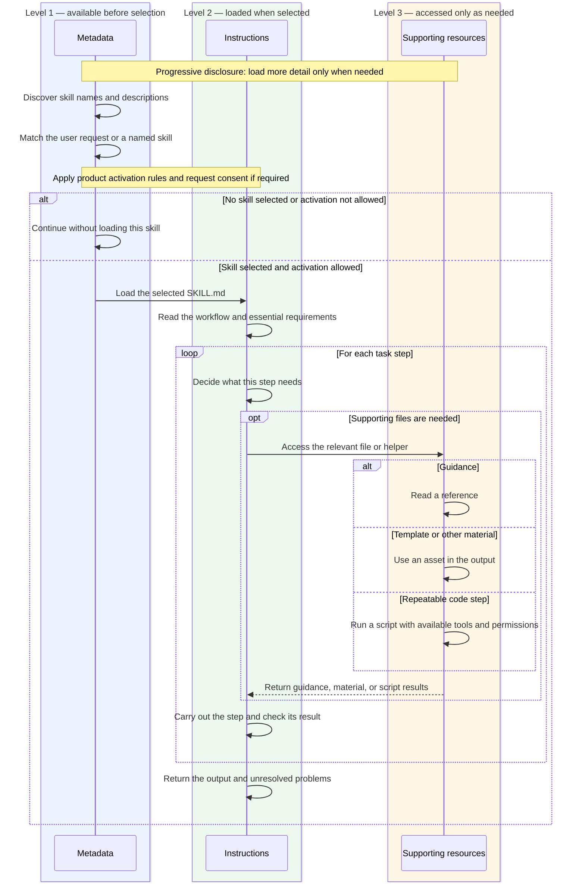

# Agent Skills Basics

Written on 2026-09-28. Codex behavior and product details were checked against the documentation on 2026-09-29.

## What belongs in a skill?

A skill is a folder with a `SKILL.md` file. The file starts with a YAML block, called *front matter*, that describes the skill. Markdown instructions follow it. [Agent Skills specification](https://agentskills.io/specification)

The YAML block must include two fields:

- `name`: matches the folder name and uses lowercase letters, numbers, and hyphens. It can be up to 64 characters long. Hyphens cannot appear at the start or end, or next to another hyphen.
- `description`: explains what the skill does and when to use it. It must contain text and can be up to 1,024 characters long.

Optional fields include `license`, `compatibility`, and `metadata` with text values. There is also an experimental `allowed-tools` field, but support depends on the product running the agent. [Agent Skills specification](https://agentskills.io/specification)

```yaml
---
name: release-brief
description: Create a release briefing from approved change records. Use for release briefing documents, including revisions; not for release deployment.
---
```

After the YAML block, explain what information the agent needs, what decisions it must make, what it should produce, and how to check that the task is complete. Make the description specific so the agent can tell when to use this skill.

### Skill folder at a glance

Only `SKILL.md` is required. The other folders and files below are optional. The example filenames show what you might add; they are not required names.

```text
release-brief/                         Required: the skill folder
├── SKILL.md                           Required: metadata and instructions
├── agents/                            Optional: product-specific settings
│   └── openai.yaml                     Optional: OpenAI UI, policy, and dependencies
├── scripts/                           Optional: executable helpers
│   └── render-brief.mjs                Optional: example document generator
├── references/                        Optional: guidance read when needed
│   └── change-evidence.md             Optional: example evidence rules
└── assets/                            Optional: files used to make the output
    └── briefing-template.docx          Optional: example document template
```

Inside `SKILL.md`, the YAML block must include `name` and `description`, followed by Markdown instructions. These are parts of the file, not extra files or folders. The open format defines `scripts/`, `references/`, and `assets/` as optional. OpenAI's skill-creator guide also recommends `agents/openai.yaml`, but that file is an optional OpenAI addition. [Agent Skills specification](https://agentskills.io/specification), [Anatomy of a Skill](https://github.com/openai/skills/blob/main/skills/.system/skill-creator/SKILL.md#anatomy-of-a-skill)

| Directory | Use it for | Example |
| --- | --- | --- |
| `references/` | Guidance the agent reads when needed | Evidence needed to explain breaking changes |
| `assets/` | Files the agent copies or adapts for the output | A document template, logo, or approved styles |
| `scripts/` | Code for steps that should work the same way each time | Turning release data into a document |

A template belongs in `assets/`. You still need instructions that explain when and how to use it. Put rules and explanations in `references/`, and files used to make the output in `assets/`. Create these folders only when you have useful files to put in them. [OpenAI public skill-creator](https://github.com/openai/skills/blob/main/skills/.system/skill-creator/SKILL.md)

## How an agent reads a skill

An agent reads a skill in stages, loading more detail when it needs it. The specification calls this *progressive disclosure*. Each swimlane below represents a level of information used by the same agent:



Progressive disclosure keeps the agent from reading every instruction and supporting file before it knows what the task needs. Think of browsing a library: first read the catalog entry, then open the relevant book, then turn to the chapters you need. Skills use the same idea to save space in the model's context—the information it can work with at one time. [Specification: progressive disclosure](https://agentskills.io/specification#progressive-disclosure)

**Level 1: metadata helps the agent choose.** The name and description explain what a skill does and when to use it. At this stage, the agent does not need the full workflow. For example, the description of `release-brief` should make it clear that the skill writes release briefings, so a request to deploy software does not look like a match. Put this selection guidance in the description, where the agent can see it before loading the instructions. [OpenAI skill-creator: progressive disclosure](https://github.com/openai/skills/blob/main/skills/.system/skill-creator/SKILL.md#progressive-disclosure-design-principle)

**Level 2: instructions explain how to do the task.** Once the skill is selected, the agent reads `SKILL.md`. For `release-brief`, this could explain which change records to gather, how to handle missing evidence, and what the briefing must include. Keep the main steps and essential checks here so the agent can understand the workflow without opening every reference. The specification recommends keeping this file below 500 lines. [Specification: progressive disclosure](https://agentskills.io/specification#progressive-disclosure)

**Level 3: supporting files provide detail when needed.** A release with breaking changes might require `references/breaking-changes.md`; a routine release might not. A DOCX briefing might use a template and generator that a short Markdown summary does not need. Reading a reference adds text to context. Using a template or running a script can help produce the output without loading the whole file as text, though the agent may inspect it when needed. [OpenAI skill-creator: bundled resources](https://github.com/openai/skills/blob/main/skills/.system/skill-creator/SKILL.md#bundled-resources-optional)

To make this work, give each supporting file a clear purpose and tell the agent when to use it. For example: "For breaking changes, read `references/breaking-changes.md` before drafting compatibility notes." Moving a long rule into another file helps only if the agent knows when to read it. Keep essential requirements in the main instructions, or make the required reference explicit. Avoid making the agent follow a long chain of links to find a rule. [Specification: file references](https://agentskills.io/specification#file-references)

The chart shows a typical workflow rather than a fixed sequence for every product. A task can use several resources or need none at all. Progressive disclosure describes when information is loaded; it does not grant permission to run code or guarantee that the agent follows every instruction. Selection can come from a user request or the agent's judgment, and some products ask for consent before activation. See [How different products use skills](provider-differences.md) for those differences.

Keep skill descriptions short and easy to tell apart. OpenAI's September 2026 Astra guidance warns that long or overlapping descriptions can make it harder to select the right skill. It recommends specific conditions for using each skill and short instructions that direct the agent to the right branch of a workflow. This advice concerns how the model uses skills; it does not change the shared file format. [Rethinking skills and prompts for GPT-6 Astra](https://developers.openai.com/blog/rethinking-skills-and-prompts-for-gpt-6-astra)

## Writing, reviewing, and improving a skill

Start with a task you have needed more than once. Explain what the agent needs, what it should produce, and what commonly goes wrong. Include instructions that help it make better decisions. State firm requirements clearly, and leave room for judgment where several approaches could work.

Review a skill as carefully as code. Check its instructions, scripts, dependencies, templates, and any websites or services it contacts. OpenAI's API guidance warns that malicious instructions can redirect an agent or cause it to send private data elsewhere. It recommends reviewed skills and approval controls for sensitive actions. Treat retrieved documents as information to read, limit what scripts can access, and keep credentials out of the skill and its output. Enforce access limits through the sandbox or application; written warnings alone cannot enforce them. [API guide: risks and safety](https://developers.openai.com/api/docs/guides/tools-skills#risks-and-safety)

When a skill fails, save enough information to reproduce the problem: the request, relevant setup, skill version, record of the agent's steps, output, and what went wrong. Use temporary test data or remove sensitive details.

Test whether the agent chooses the right skill as well as whether it completes the task. Try requests that name the skill, requests that describe the task without naming it, requests whose meaning depends on the conversation, and related requests that should not use the skill. Combine automated checks with human review. OpenAI's evaluation guide recommends checking the result, process, style, and efficiency separately. Turn failures you observe into test cases so you can catch them if they happen again. [Testing Agent Skills Systematically with Evals](https://developers.openai.com/blog/eval-skills)

Diagnose the failure before changing the skill:

| Symptom | Check first |
| --- | --- |
| Skill does not appear | Folder location, installation, and whether it is enabled |
| Skill is listed but never selected | The description the agent sees and similar skills |
| Skill runs but skips a requirement | Unclear or conflicting instructions, or a file the agent was not told to read |
| Script fails | Input data, required software, file paths, and dependency versions |
| Output has the right structure but is hard to read | Template, document-generation code, and examples with long content |

Change one problem at a time, then rerun relevant examples under the same conditions. If results vary between runs, test more than once. A single success does not show that the skill is reliable.

Keep the instructions and supporting files together in version control. Improve the existing skill when the problems concern the same task. Split it when separate tasks need different rules. Move common rules or helpers into a shared part when several workflows need them.

## Sources

- [Agent Skills specification](https://agentskills.io/specification)
- [Codex: Build skills](https://developers.openai.com/codex/skills)
- [OpenAI public skill-creator](https://github.com/openai/skills/blob/main/skills/.system/skill-creator/SKILL.md), a moving `main` reference.
- [Rethinking skills and prompts for GPT-6 Astra](https://developers.openai.com/blog/rethinking-skills-and-prompts-for-gpt-6-astra), September 11, 2026.
- [OpenAI API guide to skills](https://developers.openai.com/api/docs/guides/tools-skills)
- [Testing Agent Skills Systematically with Evals](https://developers.openai.com/blog/eval-skills), January 22, 2026. Its historical `.codex/skills` examples differ from current Codex location documentation.

This page draws on primary sources checked on 2026-09-28 and 2026-09-29. Product behavior may change in later releases. The recommendations combine that guidance; they are not based on an audit of Codex's source code.
