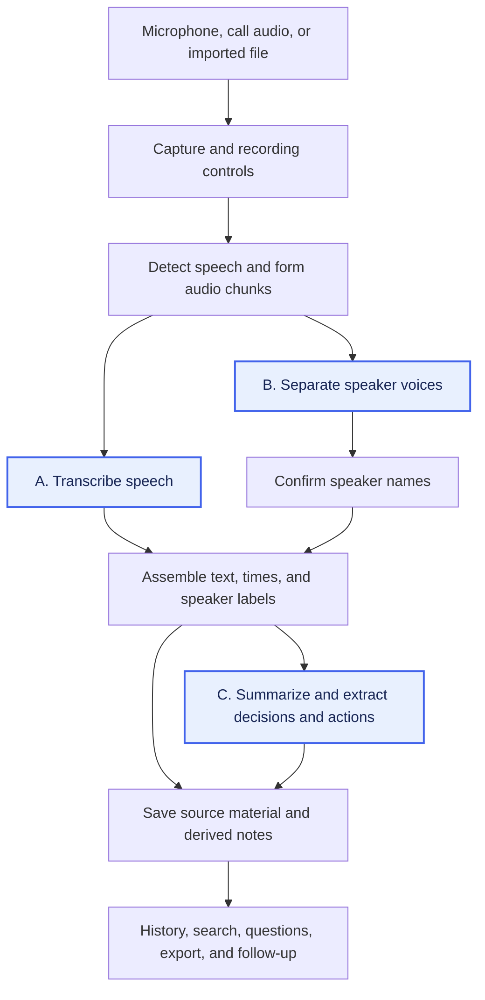

# AI Meeting Notes

This note examines how to produce meeting notes locally on a **MacBook Pro with M2 Pro and 16 GB unified memory**. The first test is whether a model can produce an accurate transcript and reliably distinguish the speakers in a meeting recording. Those outputs provide the material for summaries, decisions, and action items.

We extracted the [Feature catalogue](feature-catalogue.md) from the documented workflows of [established paid AI meeting assistants](product-coverage.md): Notion, Amie, and Spellar. Its 22 features describe the intended behavior and common failures. They give the investigation a reference: which features each pipeline step supports, how errors affect later outputs, and what additional work a local implementation needs.

## General pipeline and its bottlenecks

The [open-source local solutions](open-source-pipelines.md) **Meetily, HushScribe, VOA, and Tacet** provide implementations to inspect. Their documented pipelines capture audio, split it into speech segments, turn speech into text, and produce notes. Speaker processing adds labels to the text where supported. Saving these outputs makes them available for history, search, export, and follow-up features.

The apps schedule that work differently. HushScribe describes separating speakers after the call and generating summaries on request; Tacet describes speaker processing alongside transcription and analysis during the call. This changes when labelled text and notes become available, and which models must run together. The [source overview](open-source-pipelines.md#observed-pipeline-patterns) records the documentation and selected source files inspected on **2026-10-06**. The [configuration review](open-source-pipelines.md#confirmed-models-runtimes-and-settings), inspected on **2026-10-08**, confirms the main model paths and requirements; wider feature coverage remains outside this phase.

Consider this fictional exchange in a two-person meeting:

> Mei: “Let’s launch on Monday, not Friday.”
>
> Lin: “Agreed. I’ll update the checklist.”

Transcription needs to preserve the words, including “not.” Speaker separation needs to keep the two voices distinct so “I’ll update” stays attached to Lin’s turn. It can label them “Speaker 1” and “Speaker 2”; attaching their names requires confirmed identity information. The diagram connects those jobs to the later notes. It combines the observed paths into a general model; each app may run the steps in a different order or leave some out.

A bottleneck is a step that holds up the work that follows it. For example, if transcription takes longer to process speech than new speech takes to arrive, unfinished audio accumulates and the live text falls behind. Several models running together can also exceed the available memory. Processing speakers or summaries after the call reduces the work that must run at once, at the cost of waiting for those outputs.

Speed alone does not make the output useful. If capture misses Mei’s sentence, the transcript has no launch decision to pass to the summary step. If the text loses “not,” or the speaker labels move Lin’s words to Mei, later notes can report the wrong meaning or task owner. Keeping the text’s order, times, and speaker labels makes these errors easier to trace. The [stage-to-feature map](investigation-plan.md#pipeline-steps-and-feature-impact) lists the starting dependencies for all 22 features. Which steps limit a chosen setup on this Mac remains unmeasured.

## Why these steps can be bottlenecks and why they matter

**A. Transcription** produces the text (**MN-04**) that the other steps read. It must preserve the meeting's languages, names, technical terms, and meaning. In the exchange above, losing the word “not” changes the launch statement. A model that gets the words right but processes the recording too slowly may also be impractical. The recording test will show whether its transcript is good enough for the intended use.

**B. Speaker separation and identity** keep each part of the text attached to a voice (**MN-06**). Overlapping speech or several voices picked up by one microphone can cause speakers to be merged or labelled inconsistently. That matters even when the words are correct: Lin's “I'll update the checklist” needs to stay attached to Lin's turn. Attaching a person's name (**MN-07**) requires confirmed identity information as well as voice separation. The same recording test will check whether the speaker labels remain reliable.

**C. Summaries, decisions, and actions** use that text and speaker context to produce the notes (**MN-08**–**MN-10**). In the example, the expected decision is a Monday launch and the task belongs to Lin; no task deadline was stated. Errors in A or B can change those outputs before the summary model reads them. Long transcripts can also increase processing time and memory use at C. This makes transcription and speaker separation a useful first check, while leaving summary quality as a separate question. The planned recording test does not establish how well a summary model performs.

The [source observations](open-source-pipelines.md#what-these-patterns-tell-us) provide the starting options for that check. If a model reliably distinguishes speakers and produces a good transcript on this Mac, stop testing. If none does, use the actual failures—missing words, mixed-up speakers, or a model that cannot run—to choose further experiments with other models or pipelines.

## Testing the bottlenecks

The next steps establish what the projects use, then check whether one of those options meets the immediate need:

1. **Use the completed model review.** The [configuration review](open-source-pipelines.md) records the models, downloads, runtimes, settings, languages, macOS requirements, licenses, and local/cloud boundaries. It selects a HushScribe source build with Whisper Large v3, language detection enabled, and FluidAudio’s offline Community-1 diarizer, for the user-confirmed macOS 26.6.2 (25G83) and Chinese + English recording. Download size is not runtime memory use.
2. **The user tests a meeting recording.** Follow the [recording-trial plan](investigation-plan.md#user-run-recording-trial), using the confirmed Chinese + English setup. After the planned source build is prepared, the user installs and runs the selected setup, then returns transcript and speaker-label examples. If both outputs meet the need, stop testing; otherwise, use the observed failures to plan a focused follow-up.

## Work in progress

The model/source review is complete as of **2026-10-08**. No model was installed or run for this research. The user-run recording trial is pending; its results and any focused follow-up will be added after the user returns evidence.

## Sources

The catalogue comes from the [dated paid-product research](paid-baseline.md#sources). Pipeline observations come from the primary project documentation and selected source files listed in [Local pipeline sources](open-source-pipelines.md#sources), initially inspected on **2026-10-06**, with configuration and artifact checks on **2026-10-08**. The combined diagram, feature dependencies, and choice of first experiments are our analysis of those sources.

[Back to all topics](../../README.md)
