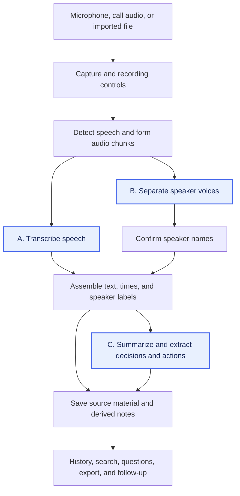

# AI Meeting Notes

The goal is to produce transcripts, speaker-labelled notes, summaries, decisions, and action items locally on a **MacBook Pro with M2 Pro and 16 GB unified memory**. We need to check whether it gets the meeting right, runs fast enough, and leaves enough memory for the call and other apps.

We extracted the [Feature catalogue](feature-catalogue.md) from the documented workflows of [established paid AI meeting assistants](product-coverage.md): Notion, Amie, and Spellar. Its 22 features describe what we want the system to do and what can go wrong. Next, we will check how local apps build those features and test how changing the models and settings changes the results.

## General pipeline and its bottlenecks

The [open-source local solutions](open-source-pipelines.md) **Meetily, HushScribe, VOA, and Tacet** show how to build this workflow. The general path is to capture audio, split it into speech segments, turn speech into text, work out who spoke, and produce notes. Saved text and notes then support history, search, export, and follow-up features.

The timing differs between apps. HushScribe describes separating speakers after the call and generating summaries on request. Tacet describes speaker processing alongside transcription and analysis during the call. The [source overview](open-source-pipelines.md#observed-pipeline-patterns) records these observations and the inspected revisions, dated **2026-10-06**. The full source review still needs to confirm the models, settings, and supported features.

The diagram shows the general path. Separating voices and naming people are different tasks: “Speaker 1” is a voice label, not a person's name. Each app may run these steps in a different order or leave some out.

A bottleneck is a step that holds up the rest of the work. During a call, transcription can fall behind if processing takes longer than new speech takes to arrive. Running several models together can also use more memory than the machine has available. Moving speaker processing or summary generation until after the call changes when the features become available and how much work must run at once.

We also need to check errors at each step. Missing audio cannot appear in the transcript. Splitting a sentence badly can lose the words needed to identify a decision or task. Saved text needs to keep its order, times, and speaker labels so we can check the notes against the conversation. The [stage-to-feature map](investigation-plan.md#pipeline-steps-and-feature-impact) lists the starting dependencies for all 22 features. We have not measured the bottlenecks on this Mac yet.

## Why these steps can be bottlenecks and why they matter

**A. Transcription** turns speech into text. Its model and settings need to handle English, Chinese, and mixed speech (**MN-04**) while keeping up with the recording. If it is too slow, unfinished audio builds up and the live transcript falls behind. If it gets a name, technical term, or “not” wrong, later notes may repeat that mistake. We therefore need to test both speed and accuracy. Times attached to the text also help with navigation (**MN-05**) when the matching audio is kept.

**B. Speaker separation and identity** work out which voice said each part (**MN-06**) and attach confirmed names (**MN-07**). This adds processing alongside transcription or a wait after the call. Overlapping speech and voices picked up by the same microphone can make separation harder. Wrong labels can lead to wrong task owners (**MN-10**), but naming the speaker alone does not settle ownership: one person may assign a task to someone else. We need to test voice separation, naming, and task ownership separately.

**C. Summaries, decisions, and actions** require the model to read the transcript and pick out the important facts (**MN-08**), agreed decisions (**MN-09**), and tasks with stated owners and deadlines (**MN-10**). Long transcripts give it more text to process. A model that cannot take the whole transcript needs a way to process smaller parts and combine the results; details can be lost or earlier plans kept after they have changed. Model size, the amount of text supplied, and settings can affect both memory use and waiting time. Prompts and templates also change the output (**MN-11**). Check that proposals stay separate from decisions and that missing owners or deadlines are left unknown.

These are the first steps to investigate because they produce the core notes and depend on model choices. The [source observations](open-source-pipelines.md#what-these-patterns-tell-us) show that they can be tested separately. Measurements will tell us which step actually holds up a chosen setup.

If capture and transcript assembly work correctly, and A, B, and C pass the quality and resource checks, we can get local transcripts, speaker-labelled notes, summaries, decisions, and action items. “Pass” means the content is right, live processing keeps up where required, and the remaining work finishes within an acceptable wait while the call stays responsive. History, search, questions with evidence, sharing, calendars, and integrations need additional code and checks; the [coverage plan](investigation-plan.md#pipeline-steps-and-feature-impact) keeps those features visible.

## Testing the bottlenecks

1. **Check the open-source projects.** For A, B, and C, record the exact model, model version, download size, software used to run it, and relevant settings. Check the required macOS version, language support, model license, whether processing stays local, and whether the step runs during or after the call. Download size is not the same as memory needed while running. Use the [initial source overview](open-source-pipelines.md) as the starting point and confirm the details in code and configuration files.
2. **Test a meeting recording.** Use a meeting recording on the M2 Pro / 16 GB Mac to check whether a model can reliably distinguish speakers and produce a good transcript. If a model does both well enough for our needs, stop testing. If none does, use the problems in its output to plan further experiments with other models and pipelines.

## Sources

The catalogue comes from the [dated paid-product research](paid-baseline.md#sources). Pipeline observations come from the primary project documentation and selected source files listed in [Local pipeline sources](open-source-pipelines.md#sources), inspected on **2026-10-06**. The combined diagram, feature dependencies, and choice of first experiments are our analysis of those sources.

[Back to all topics](../../README.md)
