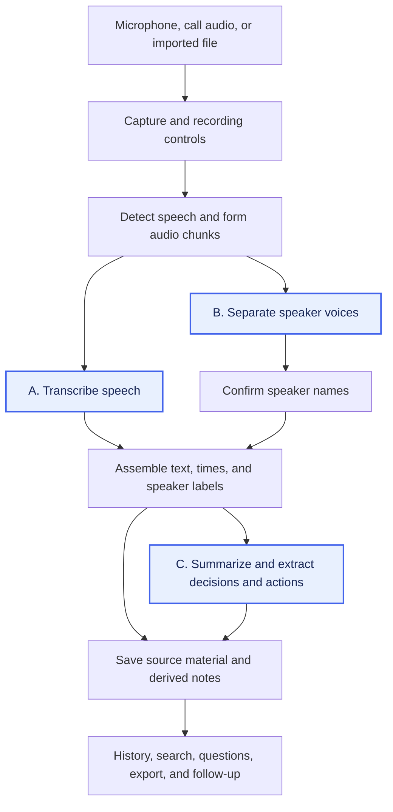

# AI Meeting Notes

A useful meeting-notes workflow turns a conversation into a transcript we can trust, a record of what was decided, and actions we can follow up on. We want to understand which parts of that workflow we can run locally on a **MacBook Pro with M2 Pro and 16 GB unified memory**, and how the processing choices affect the results.

We extracted this [Feature catalogue](feature-catalogue.md) from the documented workflows of [established paid AI meeting assistants](product-coverage.md): Notion, Amie, and Spellar. Its 22 features are our goals. The catalogue defines the expected inputs, outputs, and failure cases, so we can evaluate a local pipeline against those behaviors. The paid apps provide the starting vocabulary; the investigation now follows the features and their dependencies.

## From local solutions to a pipeline

We can observe several implementations in these [open-source local solutions](open-source-pipelines.md): **Meetily, HushScribe, VOA, and Tacet**. Their documented paths show audio capture feeding speech recognition, followed by saved transcripts and summaries. Speaker processing and timing vary: HushScribe describes speaker separation after the call and optional summaries, while Tacet describes speaker processing alongside transcription and live analysis. The [source observations](open-source-pipelines.md#observed-pipeline-patterns) record revisions and local inference options.

The diagram below combines those observations into the feature dependencies we want to study. It includes speaker naming as a separate step because separating voices only produces labels such as “Speaker 1.” Actual projects differ in which branches they implement and when they run them.

Capture and chunking determine what evidence reaches the models. Lost call audio leaves gaps in every later output; cutting a commitment across chunks can complicate transcription and attribution. Preserving timestamps, source links, and corrections through transcript assembly makes the later notes checkable. The [full dependency map](investigation-plan.md#pipeline-steps-and-feature-impact) connects these supporting steps to all 22 features.

## The three steps to test first

**A. Transcription** determines whether we get faithful English, Chinese, and mixed-language text (**MN-04**). Timing information also contributes to navigation (**MN-05**) when it survives assembly and can be linked to retained audio. A fast recognizer still needs to preserve names, technical terms, negation, and commitments: its errors become the summarizer's input.

**B. Speaker separation and identity** determine whether turns remain attached to consistent voices (**MN-06**) and, with confirmed identity context or manual naming, the correct people (**MN-07**). That context can help interpret action ownership (**MN-10**). The person speaking and the person assigned a task may differ, so ownership also requires reading the commitment correctly.

**C. Summarization and structured extraction** turn the transcript into topics and key facts (**MN-08**), explicit decisions (**MN-09**), and actions with stated owners and deadlines (**MN-10**). Prompts, templates, and supplied context affect these outputs (**MN-11**). Context limits and chunk aggregation matter for long meetings; an unknown owner or deadline must remain unknown.

These steps deserve the first feasibility tests because they produce the core content and introduce model/runtime choices we need to evaluate. This is an initial test priority; measurements will establish the actual bottlenecks. The [local pipeline sources](open-source-pipelines.md#what-these-patterns-tell-us) show why transcription, speaker processing, and summary generation can be evaluated separately.

If these steps meet the catalogue's quality criteria, run within the available memory, and finish at a useful pace—with reliable capture and transcript assembly—we have the basis for transcripts, speaker-labelled notes, summaries, decisions, and action items on this Mac. The rest of the catalogue adds storage, search, evidence-based questions, export, sharing, calendars, integrations, and follow-up behavior. Those features need their own application work and dependency checks.

## Test the pipeline on our Mac

To find out whether the machine can support those features, use the same recordings across candidate components and keep the intermediate outputs:

1. **Prepare known examples.** Include English, Chinese, mixed speech, multiple speakers, technical terms, explicit decisions, and commitments with and without owners or deadlines. Add a long meeting to expose context and backlog problems. Supply reference text, speaker turns, and expected notes.
2. **Test A, B, and C separately.** Measure transcription accuracy and processing speed, speaker separation and naming errors, and summary/action quality. Give C the reference transcript first, then the generated transcript, to distinguish extraction errors from upstream mistakes. Record loading time separately from processing time.
3. **Run the steps together alongside a meeting app.** Check missing audio, headset changes, live transcript delay, peak memory, memory pressure, swap growth, and call responsiveness. A component that works alone still has to share the machine with the other steps and the call.
4. **Compare processing schedules.** Test live transcription with summaries generated after the call, then any useful overlapping processing. Compare model choices, chunk sizes, and unloading between stages. Record which features remain available and what changes in quality, latency, and memory.

A useful result tells us which feature set is practical, how much correction it needs, and which processing schedule supports it. Record exact component/model versions and repeat timed runs three times. The [investigation plan](investigation-plan.md) contains the complete measurement rules and coverage requirements; the [review guide](review-guide.md) explains how to inspect the findings and choose experiments.

The current evidence is a feature catalogue and an initial source overview. Local performance and output quality have not been measured. This work supports [#167](https://github.com/pomodorozhong/rabbit-holes/issues/167); the final assessment will determine whether it is ready to resolve or needs follow-up work.

## Sources

The catalogue comes from the [dated paid-product research](paid-baseline.md#sources). Pipeline observations come from the primary project documentation and selected source files listed in [Local pipeline sources](open-source-pipelines.md#sources), inspected on **2026-10-06**. The combined diagram, feature dependencies, and choice of first experiments are our analysis of those sources.

[Back to all topics](../../README.md)
