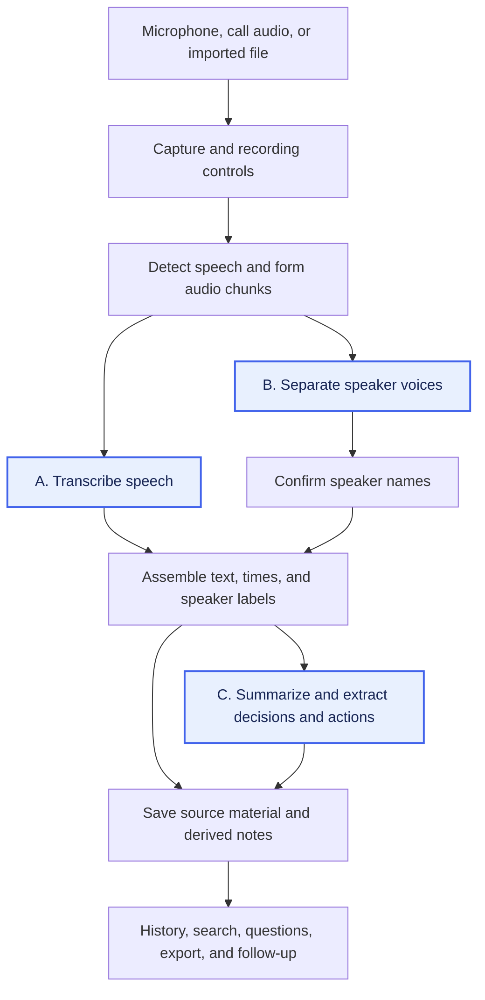

# AI Meeting Notes

The goal is to produce transcripts, speaker-labelled notes, summaries, decisions, and action items locally on a **MacBook Pro with M2 Pro and 16 GB unified memory**. We need to check whether it gets the meeting right, runs fast enough, and leaves enough memory for the call and other apps.

We extracted the [Feature catalogue](feature-catalogue.md) from the documented workflows of [established paid AI meeting assistants](product-coverage.md): Notion, Amie, and Spellar. Its 22 features describe what we want the system to do and what can go wrong. Next, we will check how local apps build those features and test how changing the models and settings changes the results.

## General pipeline and its bottlenecks

The [open-source local solutions](open-source-pipelines.md) **Meetily, HushScribe, VOA, and Tacet** show how to build this workflow. The general path is to capture audio, split it into speech segments, turn speech into text, work out who spoke, and produce notes. Saved text and notes then support history, search, export, and follow-up features.

The timing differs between apps. HushScribe describes separating speakers after the call and generating summaries on request. Tacet describes speaker processing alongside transcription and analysis during the call. The [source overview](open-source-pipelines.md#observed-pipeline-patterns) records these observations and the inspected revisions, dated **2026-10-06**. The full source review still needs to confirm the models, settings, and supported features.

The diagram shows the general path. Separating voices and naming people are different tasks: “Speaker 1” is a voice label, not a person's name. Each app may run these steps in a different order or leave some out.

A bottleneck is a step that holds up the rest of the work. During a call, transcription can fall behind if processing takes longer than new speech takes to arrive. Running several models together can also use more memory than the machine has available. Moving speaker processing or summary generation until after the call changes when the features become available and how much work must run at once.

We also need to check errors at each step. Missing audio cannot appear in the transcript. Splitting a sentence badly can lose the words needed to identify a decision or task. Saved text needs to keep its order, times, and speaker labels so we can check the notes against the conversation. The [stage-to-feature map](investigation-plan.md#pipeline-steps-and-feature-impact) lists the starting dependencies for all 22 features. We have not measured the bottlenecks on this Mac yet.

## Why these steps can be bottlenecks and why they matter

**A. Transcription** turns speech into text (**MN-04**). Missing words, wrong names, or a missed “not” can change what the meeting appears to have agreed. A slow model can also take too long to process the recording. The first practical check is whether it produces a good transcript from our meeting recording, including the languages and technical terms used in that meeting.

**B. Speaker separation and identity** work out which voice said each part (**MN-06**). Overlapping speech or several voices picked up by one microphone can lead to speakers being mixed together or labelled inconsistently. Even accurate words become less useful if they are attached to the wrong speaker. We need reliable speaker labels in the same recording test. Attaching people's names (**MN-07**) also needs confirmed identity information; separating voices alone does not provide it.

**C. Summaries, decisions, and actions** depend on the transcript and speaker labels. Errors there can become wrong summaries (**MN-08**), decisions (**MN-09**), or task owners (**MN-10**). Long transcripts can also increase the summary model's memory needs and processing time. This explains why getting A and B right matters for later notes. We will record the summary models used by the projects, but the recording test focuses on speaker detection and transcript quality; it does not establish summary quality.

The next test is a practical check of the recording, not a full set of model benchmarks. If a model reliably distinguishes speakers and produces a good transcript on this Mac, stop testing. If none does, use the observed problems—such as missing words, mixed-up speakers, or a model that cannot run—to decide which other models or pipeline changes need experiments. The [source observations](open-source-pipelines.md#what-these-patterns-tell-us) provide the starting options.

## Testing the bottlenecks

1. **Check the open-source projects.** For A, B, and C, record the exact model, model version, download size, software used to run it, and relevant settings. Check the required macOS version, language support, model license, whether processing stays local, and whether the step runs during or after the call. Download size is not the same as memory needed while running. Use the [initial source overview](open-source-pipelines.md) as the starting point and confirm the details in code and configuration files.
2. **Test a meeting recording.** Use a meeting recording on the M2 Pro / 16 GB Mac to check whether a model can reliably distinguish speakers and produce a good transcript. If a model does both well enough for our needs, stop testing. If none does, use the problems in its output to plan further experiments with other models and pipelines.

## Work in progress

This note is still being developed. The model review and meeting-recording test are pending. Their results, and any further experiments they call for, will be added here.

## Sources

The catalogue comes from the [dated paid-product research](paid-baseline.md#sources). Pipeline observations come from the primary project documentation and selected source files listed in [Local pipeline sources](open-source-pipelines.md#sources), inspected on **2026-10-06**. The combined diagram, feature dependencies, and choice of first experiments are our analysis of those sources.

[Back to all topics](../../README.md)
