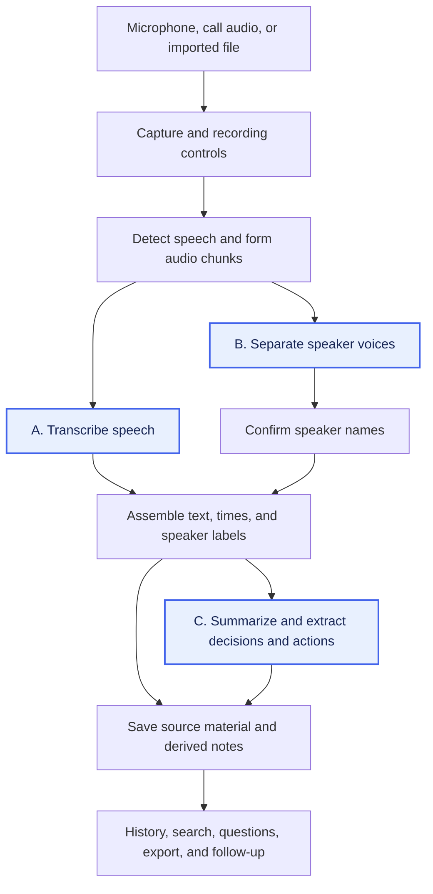

# AI Meeting Notes

The goal is to produce transcripts, speaker-labelled notes, summaries, decisions, and action items locally on a **MacBook Pro with M2 Pro and 16 GB unified memory**. The main questions are whether the pipeline preserves the meeting's content and whether it can process that content within the machine's memory and latency constraints.

We extracted the [Feature catalogue](feature-catalogue.md) from the documented workflows of [established paid AI meeting assistants](product-coverage.md): Notion, Amie, and Spellar. Its 22 features define the target behavior, including inputs, outputs, and failure cases. The remaining work is to trace those features through local implementations and test how component choices affect them.

## From local solutions to a pipeline

The [open-source local solutions](open-source-pipelines.md) **Meetily, HushScribe, VOA, and Tacet** provide concrete pipelines to inspect. They capture audio, run speech recognition, and save transcripts and summaries. Their processing schedules differ: HushScribe describes speaker separation after the call and optional summaries; Tacet describes speaker processing alongside transcription and live analysis. These observations come from documentation and selected source files inspected on **2026-10-06**. The [source overview](open-source-pipelines.md#observed-pipeline-patterns) records the revisions and local inference options; the complete implementation audit remains part of the [investigation plan](investigation-plan.md#three-phase-roadmap).

The diagram combines these paths into a dependency model for the catalogue. Speaker naming is separate from voice separation: a label such as “Speaker 1” distinguishes a voice but does not identify the person. Each project's actual stage order, supported branches, and processing schedule need to be checked against its source.

Capture and chunking determine what evidence reaches the models. Missing call audio removes content from the transcript and every derived output. A chunk boundary through a commitment can split the wording needed for transcription, attribution, or extraction. Transcript assembly must preserve order, timestamps, speaker labels, and source links so a generated decision or action can be checked against the conversation. The [stage-to-feature map](investigation-plan.md#pipeline-steps-and-feature-impact) records the initial dependencies for all 22 features; source inspection and experiments will refine them.

## The three steps to test first

**A. Transcription** produces the English, Chinese, and mixed-language text required by **MN-04**. Model choice, language handling, and chunk boundaries affect whether names, technical terms, negation, and commitments survive. Those errors propagate into summaries and actions, so recognition quality and processing speed need separate measurements. Timestamps contribute to navigation (**MN-05**) when assembly preserves them and the corresponding audio is retained.

**B. Speaker separation and identity** attach turns to consistent voices (**MN-06**) and, with confirmed identity context or manual naming, to people (**MN-07**). This helps resolve action ownership (**MN-10**), but the person speaking may assign a task to someone else. Test voice separation, name assignment, and ownership interpretation separately. A pipeline that finalizes speaker labels after the call may support accurate saved notes while leaving the live transcript unlabelled.

**C. Summarization and structured extraction** produce topics and key facts (**MN-08**), explicit decisions (**MN-09**), and actions with stated owners and deadlines (**MN-10**). Prompts, templates, supplied context, and output schemas affect what is captured (**MN-11**). For long meetings, context limits and chunk aggregation can drop details or carry stale commitments forward. Evaluate the output against reference facts: a proposal must remain a proposal, and an unstated owner or deadline must remain unknown.

We test these three steps first because they produce the core content. Their models and runtimes are the first choices to evaluate for output quality, processing time, and memory use. The [observed component boundaries](open-source-pipelines.md#what-these-patterns-tell-us) make separate tests practical. This test order follows the feature dependencies; the bottleneck ranking requires measurements of the selected configuration on this Mac.

With reliable capture and transcript assembly, passing these tests would establish a local path to transcripts, speaker-labelled notes, summaries, decisions, and action items. Passing means meeting the catalogue's quality criteria, keeping up with incoming speech where live output is required, and completing deferred processing within an acceptable wait without excessive memory pressure. No configuration has been measured yet. Storage, search, questions with evidence, export, sharing, calendars, integrations, and follow-up behavior add further application work and dependencies, recorded in the [coverage plan](investigation-plan.md#pipeline-steps-and-feature-impact).

## Test the pipeline on the target Mac

Use shared recordings and reference outputs across candidate components. Retain each stage's output so failures can be traced to capture, recognition, attribution, assembly, or extraction. The experiment sequence is:

1. **Prepare reference cases.** Include English, Chinese, mixed speech, multiple speakers, technical terms, explicit decisions, and commitments with and without owners or deadlines. Add a long meeting to expose context and backlog problems. Supply reference text, speaker turns, and expected notes.
2. **Test A, B, and C separately.** Measure recognition errors and processing time relative to audio duration; check speaker separation and naming independently; compare summaries and actions with the reference facts. Give C the reference transcript first, then the generated transcript, to distinguish extraction errors from upstream mistakes. Record loading time separately from processing time.
3. **Run the combined pipeline alongside a meeting app.** Check missing audio, headset changes, transcript delay, queue growth, peak memory, memory pressure, swap growth, and call responsiveness. This establishes whether components that work separately can share the machine during a call.
4. **Compare processing schedules.** Start with live transcription and summaries generated after the call. Then test overlapping processing where it enables a required feature. Compare model choices, chunk sizes, and unloading between stages, recording the effect on feature coverage, quality, latency, and memory.

Record exact component/model versions and repeat timed runs three times. For each configuration, report feature coverage, errors, correction effort, processing times, and memory demand together with the processing schedule. The [investigation plan](investigation-plan.md) contains the complete measurement rules and coverage requirements; the [review guide](review-guide.md) defines the checkpoint for selecting experiments after the implementation audit.

The next deliverable is the complete implementation audit, followed by the reviewed experiment selection and local measurements. The resulting feature and resource assessment will determine whether [#167](https://github.com/pomodorozhong/rabbit-holes/issues/167) is ready to resolve or needs follow-up work.

## Sources

The catalogue comes from the [dated paid-product research](paid-baseline.md#sources). Pipeline observations come from the primary project documentation and selected source files listed in [Local pipeline sources](open-source-pipelines.md#sources), inspected on **2026-10-06**. The combined diagram, feature dependencies, and choice of first experiments are our analysis of those sources.

[Back to all topics](../../README.md)
