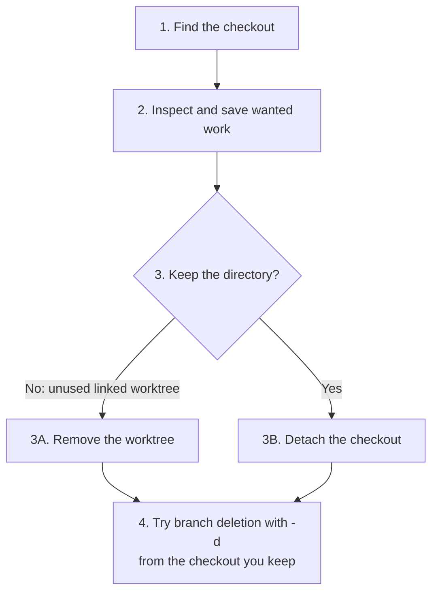

# Deleting a branch checked out in another worktree

Git refuses to delete a branch when any worktree has it checked out:

```text
error: cannot delete branch 'my-branch' used by worktree at '/path/to/worktree'
```

That worktree still uses `my-branch`. Even `git branch -D` refuses to delete it. To release the branch, first inspect and save your work, then either remove the checkout or detach it from the branch. Finally, delete the branch from a checkout you keep. See the [branch documentation](https://git-scm.com/docs/git-branch).

The four steps below follow this decision:



Removal deletes the checkout's directory; detachment keeps its files. Git cannot remove the main worktree, so detach it if it uses the branch you want to delete. Both alternatives release the branch, but Git still checks its merge status when you use `-d`. Step 4 explains how to handle a refusal.

## 1. Find the checkout that uses the branch

Run this command in any checkout of the repository:

```bash
git worktree list
```

**Illustrative output:** replace these paths and branch names in the commands below with your own values. The commit IDs are examples.

```text
/path/to/repository  a1b2c3d [main]
/path/to/worktree    e4f5a6b [my-branch]
```

Find the line ending in `[my-branch]`. Its first column identifies the checkout to inspect: `/path/to/worktree` in this example. Git lists the main worktree first; here, `/path/to/repository` stays on `main` and provides the checkout from which we will delete the branch.

## 2. Inspect and save wanted files and commits

Check what you would lose if you removed the directory:

```bash
git -C /path/to/worktree status --short
git -C /path/to/worktree status --short --ignored
git -C /path/to/worktree log --oneline --decorate -5
```

`-C` tells Git which checkout to use. The first status command shows changes to tracked files and untracked files; the second also shows ignored files. For example, `?? notes.txt` identifies an untracked file, while `!! .env` identifies an ignored file. Git has no committed copy of an untracked file. Ordinary status omits ignored files, so empty output alone does not tell you whether you can discard the directory.

Commit changes you want Git to retain, or copy wanted files outside the checkout you might remove. Include ignored files such as local configuration. The recent log helps you recognize commits to keep, but its last five entries do not prove that another branch contains all your work. Keep `my-branch` until you review its merge status in step 4.

## 3. Release the branch: remove or detach the checkout

Choose **one** of the following alternatives. Remove an unused linked worktree after saving wanted work. Detach the checkout if you need to keep the directory or if it is the main worktree, which Git cannot remove.

### 3A. Remove an unused linked worktree

Run the removal command from the checkout you intend to keep:

```bash
git -C /path/to/repository worktree remove /path/to/worktree
```

Git deletes the linked checkout's directory and its administrative entry, but keeps `my-branch`. Git refuses ordinary removal if the checkout contains changes to tracked files or untracked files; it can still remove ignored files. If removal fails, read the error and revisit step 2 or choose detachment. Do not add `--force` merely to bypass the refusal. See [worktree removal](https://git-scm.com/docs/git-worktree#Documentation/git-worktree.txt-remove).

After Git removes the worktree, skip 3B and continue at step 4.

### 3B. Detach the checkout to keep its directory

Tell Git to keep the checkout at its current commit without attaching it to `my-branch`:

```bash
git -C /path/to/worktree switch --detach
```

Git leaves the files in place and detaches the checkout from `my-branch`, keeping it at its current commit. If switching fails, resolve the reported condition without discarding wanted changes, then retry. See [Git's detachment option](https://git-scm.com/docs/git-switch#Documentation/git-switch.txt---detach).

If you plan to make new commits in this directory, first attach it to another branch, for example with `git -C /path/to/worktree switch -c continued-work`. That gives Git a branch name to retain those commits. After detachment succeeds, continue at step 4.

## 4. Delete the branch from the checkout you keep

Run deletion from `/path/to/repository`, which remains on `main` in this example. If you detached your only checkout, first switch it to the existing branch whose history you intend to keep, then use that checkout's path here:

```bash
git -C /path/to/repository branch -d my-branch
```

Each checkout has a **HEAD**, a reference that identifies its current commit. Usually `HEAD` follows a branch; a detached checkout points directly to a commit. A branch can also have an **upstream**, the branch you configured it to track, such as `origin/my-branch`. Git allows `-d` when that upstream contains all the branch's commits. If the branch has no upstream, Git checks against the checkout's `HEAD` instead. See [deletion options](https://git-scm.com/docs/git-branch#Documentation/git-branch.txt--d).

Run deletion from the checkout whose history you want to keep. If you run it from the newly detached checkout, its `HEAD` still points to the tip of `my-branch`, so the fallback check can pass even when `main` lacks those commits.

If Git reports unmerged commits, review them before retrying. For this example, compare against `main`:

```bash
git -C /path/to/repository log --oneline main..my-branch
```

The output lists commits that `my-branch` contains and `main` does not. Empty output means `main` already contains all its commits. If `my-branch` has an upstream, also compare against that branch to understand Git's refusal. For example, if it tracks `origin/my-branch`, replace `main..my-branch` with `origin/my-branch..my-branch`.

Choose how to handle any commits you want to keep:

- **Merge the work into the branch Git checks.** After merging, retry `git -C /path/to/repository branch -d my-branch`.
- **Keep the work on another named branch.** For example, run `git -C /path/to/repository branch saved-work my-branch`. This retains the commits, but does not make the merge check pass. Delete the original branch with `git -C /path/to/repository branch -D my-branch` only if you deliberately choose to bypass that check.

If you decide to discard unmerged work, `-D` also deletes the branch reference without passing the merge check. Force deletion does not preserve a backup. If Git instead reports a checkout still using the branch, return to step 1.

### If the checkout directory is already missing

If someone deleted the directory outside Git, inspect `git worktree prune --dry-run` before running `git worktree prune` to clear stale entries. Do not prune a checkout just because its disk or network share is temporarily unavailable. Once Git clears the stale entry, follow step 4. Pruning does not remove a live checkout.

## A disposable reproduction

Reproduce the error in a separate repository, then resolve it by removal or detachment. Use new, unused directories and configure a Git author identity before running the commit command. The demonstration starts `my-branch` at the same commit as `main`, so the final merge check can pass.

### Create the checkout and reproduce the refusal

```bash
git init --initial-branch=main worktree-demo
git -C worktree-demo commit --allow-empty -m "Initial commit"
git -C worktree-demo worktree add -b my-branch ../worktree-demo-linked
git -C worktree-demo branch -d my-branch
# Expected: refuses because my-branch is checked out.
```

Git creates the linked checkout on `my-branch`, then refuses to delete that branch while the checkout uses it.

### Follow steps 1 and 2: locate and inspect the checkout

```bash
git -C worktree-demo worktree list
git -C worktree-demo-linked status --short
git -C worktree-demo-linked status --short --ignored
git -C worktree-demo-linked log --oneline --decorate -5
```

The list identifies `worktree-demo-linked` as the checkout using `my-branch`. Both status commands should produce no output in this new checkout, and the log should show only the initial commit. If you added files or commits, save anything you want before continuing.

### Follow step 3: choose removal or detachment

Choose **one** alternative for this demonstration. If you no longer need the disposable checkout, remove it:

```bash
git -C worktree-demo worktree remove ../worktree-demo-linked
```

If you want to keep the directory, detach it **instead of removing it**:

```bash
git -C worktree-demo-linked switch --detach
```

Either command releases `my-branch`. Removal deletes the linked directory; detachment leaves it at the initial commit. To test both alternatives, repeat the demonstration in fresh directories for the second path.

### Follow step 4: delete the branch from the main checkout

After your chosen command succeeds, run the same deletion command from `worktree-demo`, which still has `main` checked out:

```bash
git -C worktree-demo branch -d my-branch
```

Git deletes `my-branch` because `main` already contains its commit. If you chose detachment, the linked directory remains available at that commit.

The paths, IDs, and output shown above are illustrative. Disposable test repositories verified both deletion refusals while a branch has a checkout, discovery with `worktree list`, refusal to remove an untracked file, file preservation during detachment, removal of ignored files, the detached-`HEAD` merge-check behavior, and successful deletion after preserving and merging work.

## Sources

- [Git worktree documentation](https://git-scm.com/docs/git-worktree) — listing, removal, detached checkouts, and pruning.
- [Git branch documentation](https://git-scm.com/docs/git-branch) — checked-out restrictions and safe versus forced deletion.
- [Git switch documentation](https://git-scm.com/docs/git-switch) — detachment and protection of local changes.
