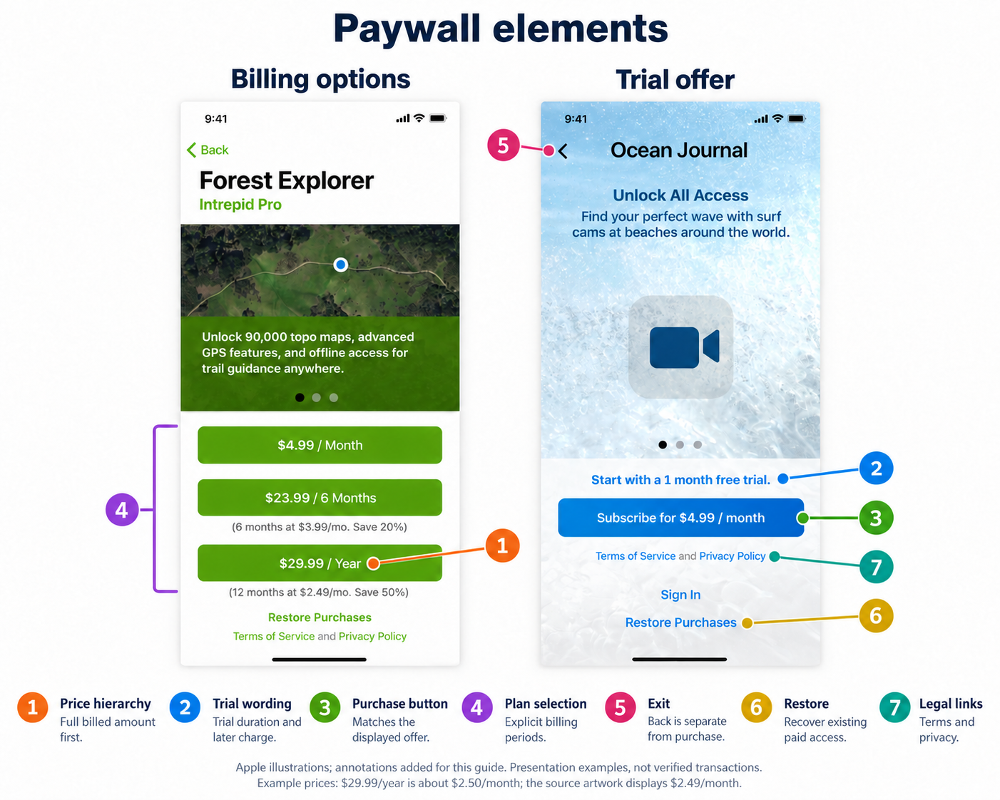

# App Review and paywall design

Use this guide to identify what a subscription rejection concerns, choose a complete response, and assess paywall designs without treating an accepted app as a template. It covers iOS subscription apps distributed through the App Store. Apple guidance was checked **2026-10-06**; the examples are dated accounts.

## Start with the place where the problem occurs

Two developers can receive an objection about subscription terms and need different fixes. In the [notJust.dev account](gallery.md#notjustdev-trial-copy-and-metadata-are-different-surfaces), the app already had legal links, but the App Store listing lacked them. The developer reports correcting the listing. In [Metacast](gallery.md#metacast-legal-links-below-the-fold), the developer believes the links were hard to find inside the app on a smaller screen and changed the layout. Both accounts report eventual acceptance or launch, without isolating the effect of that one change.

The useful first question is therefore where the reviewer encountered the problem: the public listing, the app's own paywall, Apple's purchase confirmation, or the submitted purchase products. A larger footer on the paywall would not repair a missing link in the listing. A complete listing would not make hidden in-app links easier to find.

Apple calls a purchase handled through its payment system an **in-app purchase (IAP)**. **StoreKit** is Apple's framework for displaying products and handling those purchases. A customer's **entitlement** is the access they already own; their trial eligibility determines whether a new offer applies to them. Those conditions matter because a reviewer with existing paid access may never see the purchase screen that a new customer sees.

For visual examples, start with [Lenglio, Snapkin, and Metacast in the gallery](gallery.md#browse-by-design-question). Read the [review histories](review-histories.md) to follow successive objections and developer responses, and use the [submission checklist](checklist.md) when preparing a build or response.

## What the evidence can establish

- **Written requirement:** an Apple rule or documented submission requirement.
- **Design guidance:** an Apple recommendation; preserve words such as “consider.”
- **Interpretation:** our explanation of a specific symptom or design choice.
- **Developer report:** a firsthand account, including copied reviewer messages.
- **Visible evidence:** a screenshot demonstrates its contents, not Apple's decision or the cause of that decision.

The case sample is deliberately small and selected for instructive evidence. It cannot estimate rejection rates. “Accepted” below means the developer reports acceptance of that submission, unless stronger evidence is identified. It does not certify current compliance, every product, or every paywall experiment.

## The rules to read first

| Source | Relevant constraint or guidance |
| --- | --- |
| [App Review Guidelines][guidelines], 3.1.1 and exceptions | Digital feature unlocks generally use IAP; evaluate applicable category and storefront exceptions. |
| [Guidelines][guidelines], 3.1.2(a–c) | Subscriptions need ongoing value, periods of at least seven days, clear benefits, and no deceptive selling. |
| [Subscription purchase guidance][subscriptions] | Identify the subscription and duration; make the full billed price dominant over equivalent monthly/weekly prices. Explain trial length and subsequent charge. Provide restoration/sign-in and terms/privacy links in-app and in metadata. |
| [Apple In-App Purchase Human Interface Guidelines (HIG)][hig] | Distinguish offers, describe automatic charging after a trial, and use the system confirmation sheet. Trying content first is recommended. |
| [Guidelines][guidelines], 2.3.2 and 2.3.7 | Disclose featured paid features in marketing; public screenshot metadata has restrictions on price references. |
| [Submit an IAP][submit] | The first item of each IAP type needs a new app version. Collect the version, new subscription group, and subscriptions in the same draft submission. |
| [IAP information][iap-info] | A product's App Review screenshot is review evidence, separate from public marketing media. |

Seven days is the minimum **subscription period**, not the minimum free-trial length: Apple's [introductory-offer table][offers] includes three-day trials. Eligibility is limited to one introductory offer per subscription group. Check the purchased product, offer dates, storefront, and customer eligibility rather than hard-coding “free trial” for every visitor.

## What a paywall should let someone understand

For an ordinary annual offer, our suggested information sequence is: **what is unlocked → total annual charge → trial and renewal terms → purchase action**. This sequence is a design recommendation, not a required Apple template.

For example, a fictional offer could say “Premium reading tools,” “$59.99/year,” and “7 days free, then $59.99/year; renews automatically unless canceled,” with “Start 7-day free trial” as the action. If the customer is ineligible, remove the trial promise and show the actual immediate purchase. Use localized StoreKit product/offer information. Do not copy these illustrative prices into production.

Our practical assessment of common elements:

The annotated image marks all seven elements on two illustrations from Apple's subscription guidance. The numbers match the rows below; the [checklist](checklist.md#actual-purchase-and-entitlement-behavior) covers testing the purchase and restoration behavior behind these controls.

Apple's teaching artwork illustrates presentation, without establishing an app approval or a working transaction. The annotations are ours. Prices are illustrative: $29.99/year is about $2.50/month, although the source displays $2.49/month. [Originals and annotation provenance](images/README.md#element-explanation-illustrations).

| Element | What to inspect | Reasoning |
| --- | --- | --- |
| 1. Price hierarchy | Total billed amount, period, currency, contrast, and placement | A large “$5/month” can conceal an annual commitment even if “$60/year” appears elsewhere. |
| 2. Trial wording | Duration, later charge, selected product, actual system sheet | Correct-looking copy can promise an offer that the transaction will not deliver. |
| 3. Purchase button | Meaning and agreement with the selected plan | “Continue” alone tells little; nearby terms and the system sheet still matter. A particular button title is not a universal approval rule. |
| 4. Plan selection | Recognizable choice, matching purchase action, changes to duration or price | A trial switch that silently moves annual to weekly combines separate decisions. |
| 5. Exit | Visible return route for free content, restoration, and existing subscribers | Make the promised free experience reachable. Closing a paywall does not cancel a subscription. |
| 6. Restore | Actual entitlement recovery, not just a label | A visible button with a broken restoration path solves nothing. |
| 7. Legal links | Functional links, correct destination, all relevant metadata/localizations | A paywall footer and the App Store description are different review surfaces. |

Forest Explorer uses a separate purchase button for each billing period; it does not show a selected-plan state. If your screen instead uses a picker and one purchase button, keep the selection recognizable and update the price, trial wording, and purchase action together.

**Dismissibility needs context.** The HIG recommends limited free access; it does not establish that every iOS subscription app must offer a permanent free tier. Its explicit Close/Cancel advice in the watchOS section concerns returning to free content on that platform. For a freemium iOS app, our recommendation is an obvious dismissal route. For a fully paid service, explain the business model and give reviewers access; do not promise free features behind an unavoidable purchase screen. [Apple HIG][hig], [App Review preparation][review].

## Read the specific objection, then choose the smallest complete fix

Read the full message and attachments before choosing a change. Identify the affected app version or product, then reproduce the reported route with the same device layout, storefront (the customer's App Store country or region), language, and access state. Apple's sandbox is a test purchase environment; a screen shown there still needs to agree with the offer the app promises.

The following table maps symptoms to questions worth investigating. Its hypotheses are our interpretation, not additional Apple rules:

| Reviewer symptom | First hypothesis to check | Evidence to provide or change |
| --- | --- | --- |
| Cannot find IAP / 2.1 | The supplied account already owns access, or the entry route is obscure | Exact launch-to-paywall steps; account/entitlement state; screen recording. |
| Cannot load/buy product | Submission, product IDs, availability, network, or error handling | Product/submission statuses, IDs, device/storefront, and actual StoreKit error. Do not assume pending approval is the sole cause. |
| Trial missing from sandbox sheet | The advertised product/offer and eligible customer state differ | Compare app screen with system confirmation; check offer configuration and eligibility. |
| Billed amount less conspicuous | A breakdown price or trial dominates the layout | Rebalance size, contrast, and placement; another footer line may not address prominence. |
| Remove free-trial toggle | The reviewer objects to the interaction itself | Remove the switch and make trial-bearing packages explicit; adding disclosure text alone does not answer that instruction. |
| What does the subscription provide? | Generic marketing conceals the entitlement | Name concrete paid capabilities and distinguish free access. |
| Missing Terms of Use / EULA, or a screenshot objection | The defect may be in App Store metadata | Inspect the rejected item and language version before changing the app build. EULA means end-user license agreement. |

[Lenglio, RadTrack, the toggle reports, and Vunzo](review-histories.md) illustrate these different diagnoses. The [gallery](gallery.md) marks the exact visual evidence.

Record the build and product IDs, the account's access and trial eligibility, and any remotely selected paywall variation. These details let you compare the reviewer's experience with your reproduction instead of guessing from a guideline number alone.

## Worked example: fix missing terms in the listing

Consider a **fictional reading app** whose reviewer cites 3.1.2(c) and asks for a Terms of Use link in its App Store metadata. The app has one annual subscription; its paywall already contains working Terms of Use and Privacy Policy links. The steps and reply below illustrate a response, not an actual review outcome.

1. **Reproduce the objection.** Inspect the submitted English-language listing in App Store Connect, Apple's submission-management service. Its description has a privacy link but no Terms of Use link. In the submitted build, follow Library → Settings → Upgrade and open both footer links successfully.
2. **Identify the cause.** The required destination is missing from the listing. The existence of a link inside the app does not populate the listing's metadata.
3. **Make the complete change.** Add the appropriate Terms of Use link to the affected listing, verify its destination, and check the other submitted language versions for the same omission. Record which descriptions changed. The fix in this example changes metadata; it does not require a paywall redesign.
4. **Reply with matching evidence.** Identify the version and product, describe the metadata correction, and attach a capture of the corrected description. Give the route to the existing in-app links so the reviewer can check both places.

A reply for this fictional app could read:

> For the 3.1.2(c) objection on version 1.2 (build 42), we added the missing Terms of Use URL to the English App Store description and verified that it opens the agreement. We checked the other submitted language versions; they already contain working links. The attached listing capture shows the correction.
>
> In build 42, open Library → Settings → Upgrade to find the existing Terms of Use and Privacy Policy links below the annual offer. The subscription product is `com.example.reading.premium.annual`. This response changes the listing's metadata; the submitted build is unchanged.

Use the [documented reply and metadata-resubmission workflow][reply] for the submission's actual status. If the notice instead identifies inaccessible links inside the app, reproduce that layout and fix the app. The two diagnoses need different evidence even when they cite the same subscription guideline.

## Clarification, resubmission, and appeal

Use [App Store Connect's reply workflow][reply] to ask a focused question and attach evidence. For example: “Is the missing trial in the system sheet the remaining issue, or is the renewal disclosure on our own screen also inadequate?” For metadata-only rejection, Apple documents resubmitting the same build after correcting the metadata. [Reply to App Review][reply].

A useful reply contains the cited guideline, observed failure, exact route, relevant account state, and the change made. Say what was changed in the build versus metadata; list product IDs and attachments. Avoid submitting an unchanged binary repeatedly without answering the objection. This is our recommendation for making the evidence assessable.

If the issue is a documented behavior the reviewer misunderstood, clarify it. If the behavior or design actually contradicts the requirement, fix and resubmit. If you believe the decision is wrong after addressing information requests, [Apple's appeal guidance][review] calls for specific compliance reasons and one appeal per rejected submission. An App Review appointment is another documented channel. The [appeal account](review-histories.md#appeal-account-reopening-review-left-purchase-defects-to-fix) shows an appeal reportedly reopening review, with other defects still needing work; it is not evidence of a paywall exemption.

Apple's [unresolved-submission workflow][unresolved] distinguishes accepted and rejected items. Confirm the status of the app, subscription group, each product, and localization before release. An approved app version does not establish that all intended subscriptions are approved.

## Why similar screens can get different decisions

Our synthesis of the cases suggests several explanations worth checking:

1. **Different states:** a new user sees a trial; an existing subscriber skips the paywall; an ineligible account sees a charge immediately.
2. **Different surfaces:** the same priced screenshot can be useful review evidence and unsuitable public marketing metadata.
3. **Different submissions:** an app version and its products have distinct review histories. Local test configuration is not submission evidence.
4. **Different evidence:** clearer benefit descriptions, product IDs, or a video can resolve an ambiguity without a new visual style.
5. **Different dates and reviewers:** the toggle thread contains both rejection and approval anecdotes. Neither proves uniform enforcement or a published rule change. A screenshot of a reviewer instruction supports that case.

The visible comparison is confounded whenever copy, products, metadata, and submission state change together. Lenglio's before/after example supports a practical lesson about clarity, not a controlled claim that one added bullet caused approval. Do not infer Apple's use of automation from absent backend logs or quick responses.

The [gallery](gallery.md) also separates review fixes from growth experiments and proposed layouts. Metacast and Snapkin describe several review corrections; Foodnoms and Dark Noise report business experiments; Melonote is still a proposal. Headway is an outside observer's teardown. Conversion results, product availability, and a popular app's screenshot do not establish Apple's acceptance of an exact layout.

## Storefront and policy dates matter

| Context, checked 2026-10-06 | Implication for a design review |
| --- | --- |
| US storefront | Current 3.1.1(a) permits external purchase calls to action without the entitlement otherwise discussed there. This does not make every in-app sales practice unrestricted. [Guidelines][guidelines]. |
| EU storefronts | Apple's support page records unified terms effective **2026-10-01**, replacing earlier addenda. Alternative payments/offers have implementation, child-safety, and business obligations; do not reuse a 2025 fee/entitlement summary. [Current EU support][eu]. |
| Japan | Apple's payment program describes eligible iPhone apps on iOS 26.2+, entitlements, disclosures, and transaction reporting. Verify the OS-specific implementation. [Japan support][japan]. |
| Other storefronts and categories | Check the current rule and applicable exception before adding web checkout. Device language or an IP address alone is not an explanation of the applicable storefront. |

The January 2026 toggle reports and July 2025 Lenglio outcome precede the current research date. The HIG page itself identifies a **2026-09-17** update. Refresh Apple's current pages before adopting an old paywall example or external-payment flow; this guide is a dated research snapshot.

## Sources and research limits

Apple links below were inspected on 2026-10-06. The supporting element illustrations and their sources were inspected on 2026-10-08. The [review histories](review-histories.md) link to original developer accounts, with dates and reported outcomes. [Image provenance](images/README.md) identifies the preserved assets, source artwork, fictional prices, and acquisition limits. The gallery selects examples with inspectable media; its coverage does not represent the frequency of review problems across apps.

No App Store Connect account, app binary, transaction, or appeal was tested for this research. Versions/storefronts absent from the sources remain unknown. There is no independently authenticated Apple approval record for the accepted paywall screenshots. Missing intermediate or revised images are identified in the relevant cases. Acquisition methods and the search limitation for Threads are recorded in provenance.

[guidelines]: https://developer.apple.com/app-store/review/guidelines/
[subscriptions]: https://developer.apple.com/app-store/subscriptions/
[hig]: https://developer.apple.com/design/human-interface-guidelines/apple-in-app-purchase
[offers]: https://developer.apple.com/help/app-store-connect/manage-subscriptions/set-up-introductory-offers-for-auto-renewable-subscriptions/
[submit]: https://developer.apple.com/help/app-store-connect/manage-submissions-to-app-review/submit-an-in-app-purchase/
[iap-info]: https://developer.apple.com/help/app-store-connect/reference/in-app-purchases-and-subscriptions/in-app-purchase-information
[review]: https://developer.apple.com/app-store/review/
[reply]: https://developer.apple.com/help/app-store-connect/manage-submissions-to-app-review/reply-to-app-review-messages
[unresolved]: https://developer.apple.com/help/app-store-connect/manage-submissions-to-app-review/manage-a-submission-with-unresolved-issues
[eu]: https://developer.apple.com/support/apps-in-the-eu/
[japan]: https://developer.apple.com/support/payment-options-on-the-app-store-in-japan/
