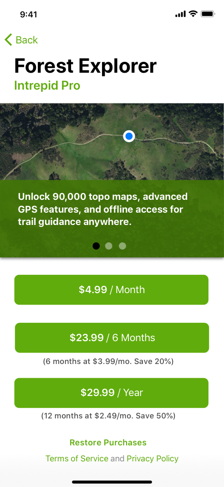
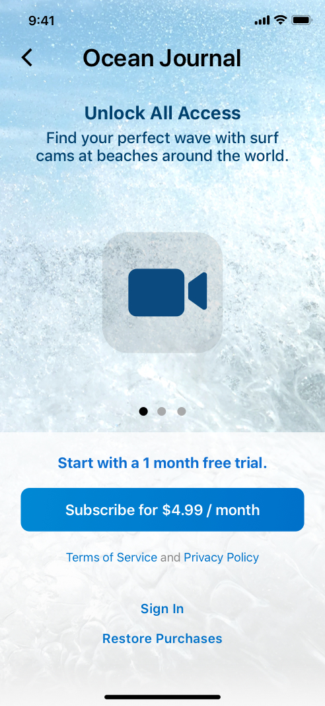

# Paywall elements, illustrated

[Guide](README.md#what-a-paywall-should-let-someone-understand) · [App gallery](gallery.md) · [Checklist](checklist.md)

This companion explains the seven elements assessed in the guide. The [annotated overview](images/paywall-elements-annotated.png) marks them with numbers in the same order as the sections below. Its two illustrations from [Apple's subscription guidance][subscriptions] show a purchase with several billing periods and a purchase with a trial. Each section connects a visible element with the decision it helps someone make and a practical check for your own app.

These are Apple's teaching illustrations, not captures of an independently verified approved app. The prices are example values. They illustrate presentation; the transaction, account eligibility, restoration, and destinations still need testing. Sources and artwork were checked **2026-10-08**; [image provenance](images/README.md#element-explanation-illustrations) records the original assets.

## Price hierarchy

In Apple's Forest Explorer illustration, each green purchase button names the full charge and its billing period. The monthly equivalents and savings sit below the longer-period buttons in smaller text. Someone choosing annual access can identify the annual payment before considering its equivalent monthly cost.

**Lesson:** Make the amount charged for the selected period easy to identify. A monthly breakdown can help comparison, but should not make a yearly purchase look like monthly billing. Apple's [billing guidance][subscriptions] requires the billed amount to lead the pricing hierarchy.

**Check:** Read the screen at normal phone size. Can someone state the next full charge and billing period without doing arithmetic? Calculate any breakdown and savings from the actual localized prices. For example, 29.99 divided by 12 is approximately 2.50; the illustration's 2.49 label should not be copied as an exact conversion.

## Trial wording

Apple's Ocean Journal illustration puts a one-month trial promise directly above a purchase button that names the later monthly charge. The reader can connect the initial offer with the paid subscription that follows it.

**Lesson:** Explain both parts of the offer: the trial and the payment after it. In your own copy, make renewal explicit too. A fictional localized offer could read: “One month free, then US$4.99/month. Renews automatically unless canceled.” The actual product and account must support that promise.

**Check:** Compare the paywall with Apple's purchase confirmation for an eligible new customer and a customer who has already used the introductory offer. Trial duration, subsequent charge, and billing period should agree. An ineligible customer needs the actual purchase terms. Apple's [offer guidance][offers] limits introductory-offer eligibility within a subscription group.

## Purchase button

The blue button in the [Ocean Journal illustration](#trial-wording) includes the subscription price and period. Its meaning comes from that amount together with the trial statement immediately above it. The purchase action and the terms are in the same decision area.

**Lesson:** Button wording should describe the offer currently available. A trial-specific label can help an eligible customer; it becomes misleading if the selected plan or customer has no trial. Apple's [SubscriptionStoreView documentation][storekit-view] describes a system component that renders localized subscription information and a purchase button. A custom screen needs the same agreement between product data and presentation.

**Check:** Change the plan and customer eligibility, then inspect the button and surrounding terms before opening the system sheet. They should all describe the same purchase. A correct button title alone cannot repair contradictory pricing elsewhere.

## Plan selection

The [Forest Explorer illustration](#price-hierarchy) offers a separate purchase action for each billing period. It makes the duration part of the action rather than requiring a trial switch to choose a different product. It does not show a persistent selected-plan state.

**Lesson:** A picker followed by one purchase button is another possible design. In that design, the selected option must remain recognizable and the purchase action must follow it. Plan duration and trial availability are separate facts; changing one should not quietly change the other.

**Check:** For a fictional monthly/yearly picker, select monthly, then yearly, then monthly again. At each step, compare the selected indicator, full price, trial wording, and product opened in Apple's confirmation sheet. An unavailable trial should change the terms rather than silently moving the customer to a different billing period.

## Exit

The back control at the top of both Apple illustrations is separate from the purchase controls. It gives a recognizable way to leave this screen. The pictures do not show the destination.

**Lesson:** For a freemium app, dismissal should lead to the promised free experience; verify that route in the app. A fully paid service needs an honest explanation of its access model. The [guide's dismissibility discussion](README.md#what-a-paywall-should-let-someone-understand) distinguishes these contexts.

**Check:** Leave the paywall from every entry route and confirm the destination remains usable. Do the same after canceling the system purchase sheet. Closing either screen does not cancel an existing subscription; [Apple's cancellation instructions][cancel] describe a separate subscription-management action.

## Restore

Near the bottom of the [Ocean Journal illustration](#trial-wording), restoration and sign-in are separate from the purchase button. An existing subscriber can look for access they already own without starting a new subscription.

**Lesson:** Restoration must recover the applicable entitlement, meaning the paid access the customer owns. A completion message is insufficient if the app still blocks those features. [RevenueCat's restoration documentation][restore] illustrates checking whether the entitlement is active after restoring.

**Check:** Test an active subscriber after reinstalling or moving to another device, using the same store account and the app's relevant sign-in state. Confirm that paid features become available. Also test no matching purchase and a failed request: explain the result without claiming that access was restored.

## Legal links

Both Apple illustrations include terms and privacy links. In the [Ocean Journal example](#trial-wording), they sit immediately below the purchase button, while sign-in and restoration have their own positions farther down.

**Lesson:** These labels are routes to the actual documents. They need readable placement and correct destinations. Apple's [subscription guidance][subscriptions] also requires the links in App Store metadata; adding an in-app footer does not populate the store listing.

**Check:** Open both links in the submitted app, including its smallest supported layout and each submitted language. Verify the documents and return route, then separately inspect the listing's links. The [Metacast gallery case](gallery.md#metacast-legal-links-below-the-fold) shows why a link present on a large screen may be difficult to find on a smaller one.

[subscriptions]: https://developer.apple.com/app-store/subscriptions/#clear-description
[offers]: https://developer.apple.com/help/app-store-connect/manage-subscriptions/set-up-introductory-offers-for-auto-renewable-subscriptions/
[storekit-view]: https://developer.apple.com/documentation/storekit/subscriptionstoreview
[cancel]: https://support.apple.com/en-us/118428
[restore]: https://www.revenuecat.com/docs/getting-started/restoring-purchases
