# Real app paywalls: annotated evidence

[Guide](README.md) · [Developer cases](cases.md) · [Checklist](checklist.md)

Twenty original source images cover fourteen paywall cases and one reviewer message. Click an image to view it separately. We keep the source's highlights, collages, and redactions; [image provenance](images/README.md) records the details. Unless noted, sources do not identify the app version or App Store region. Prices reflect the time of the screenshots, and a dollar sign alone does not tell you the currency.

## Browse by design question

Start with **Lenglio → Snapkin → Metacast**. Each pairs screenshots with a developer's account of rejection and eventual approval or launch. Other review accounts follow, then experiments, proposed layouts, and examples of apps in use.

Each case follows **Issue → Change → Lesson → Outcome**. The issue describes a reported reviewer objection or a design question; the lesson gives our interpretation. Developers often made several changes before approval, so these examples cannot show that one change to the screen caused acceptance. Sales results also do not tell us whether customers understood the offer.

| Case | What to inspect | Evidence type |
| --- | --- | --- |
| [Lenglio](#lenglio-before-and-after-benefit-disclosure) | What customers get when they pay | Reported rejection → acceptance |
| [Snapkin](#snapkin-platform-specific-cancellation-copy) | Payment and cancellation instructions on iOS | Reported rejection → launch after several fixes |
| [Metacast](#metacast-legal-links-below-the-fold) | Finding terms links on small screens | Reported rejection → launch after several fixes |
| [notJust.dev app](#notjustdev-trial-copy-and-metadata-are-different-surfaces) | Trial length and links in the store listing | Developer reports listing rejection → acceptance |
| [RadTrack](#radtrack-paywall-versus-the-actual-transaction) | Promised trial versus actual purchase | Reported rejection; product outcome unresolved |
| [Homework app](#unnamed-homework-app-a-trial-switch-also-changes-the-package) | A trial switch also changes the billing period | Reported rejection; final outcome unknown |
| [Foodnoms](#foodnoms-feature-matrix-to-trial-timeline) | When reminders arrive and trials end | Developer-reported experiment |
| [Dark Noise](#dark-noise-revealing-all-plans-up-front) | Finding all the payment plans | Developer-reported experiment |
| [Flo](#flo-old-and-new-trial-selection) | Choosing plans with or without a trial | Observed redesign; review outcome unknown |
| [Melonote](#melonote-a-trial-timeline-on-a-small-screen) | Leaving room to choose a plan | Proposed design; no measured outcome |
| [ShotZen](#shotzen-a-badge-change-moves-the-purchase-area) | A badge edit moves purchase controls | Developer's comparison; review outcome unknown |
| [Headway](#headway-what-happens-after-declining-the-paywall) | New offers after declining a paywall | Independent observer's dated teardown |
| [Substack](#substack-plan-choice-versus-payment-route) | Separating plan choice from how to pay | Product announcement; review outcome unknown |
| [WatchFrame](#watchframe-a-native-plan-picker-with-ambiguous-free-copy) | Annual savings versus trial length | Developer's work in progress |

The [reviewer message](#reviewer-message-the-requested-change-can-be-specific) shows how a reviewer asked a developer to change the price display and trial switch.

## Rejected then reportedly accepted: before/after images

### Lenglio: before and after benefit disclosure

| Before: associated with rejection | After: developer reports acceptance |
| --- | --- |
| <a href="images/lenglio-before.png">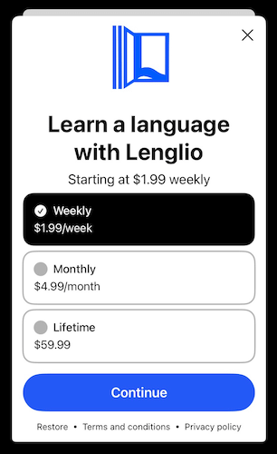</a> | <a href="images/lenglio-after.png">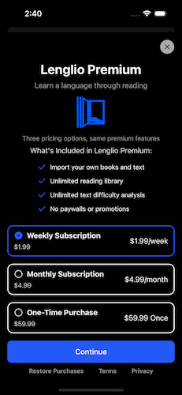</a> |

**Issue:** The developer says Apple's reviewer asked them to explain what the subscription includes (guideline 3.1.2). The original screen advertised language learning without clearly naming the features customers would pay for.

**Change:** The developer added four paid benefits: book import, unrestricted library access, text analysis, and no paywall interruptions. The new screen also explains that lifetime access requires one payment.

**Lesson:** Tell customers what they get when they pay. Make it clear which plans renew and which require only one payment so people can compare the cost and benefits.

**Outcome:** The developer says Apple approved the app on 2025-07-22 after changes to both the paywall and the App Store listing. They did not share every revision, and the in-app purchases needed separate approval. [Full case](cases.md#case-1-lenglio-made-the-paid-entitlement-explicit).

**Source:** [Lenglio developer post](https://www.reddit.com/r/iOSProgramming/comments/1og8u7v/my_first_experience_with_apple_app_store_review/), 2025-10-26. Small linked previews limit text readability.

### Snapkin: platform-specific cancellation copy

<a href="images/snapkin-before-after.jpg">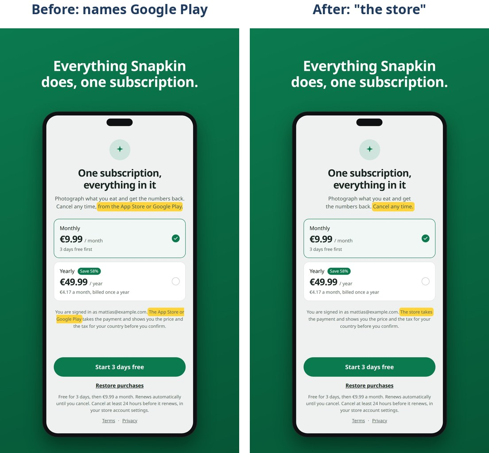</a>

**Issue:** The developer says Apple's reviewer objected to Google Play references in the iOS paywall (guideline 2.3.10). The payment and cancellation instructions named two stores without explaining which one applied to an iPhone customer.

**Change:** The developer removed the Google Play reference and used more general wording about the store handling payment. The plans and renewal terms remain visible.

**Lesson:** Explain where customers on this platform pay and cancel. Naming the right store or giving the cancellation steps is clearer than asking customers to work out what general store wording means.

**Outcome:** The developer says the app launched on 2026-09-24 after six submissions and several fixes. We cannot tell how much this wording change contributed to approval.

**Source:** [Mattias Geniar's developer blog](https://ma.ttias.be/app-store-rejection-reasons/), 2026-09-30; source-labeled before/after comparison.

### Metacast: legal links below the fold

<a href="images/metacast-layout.jpg">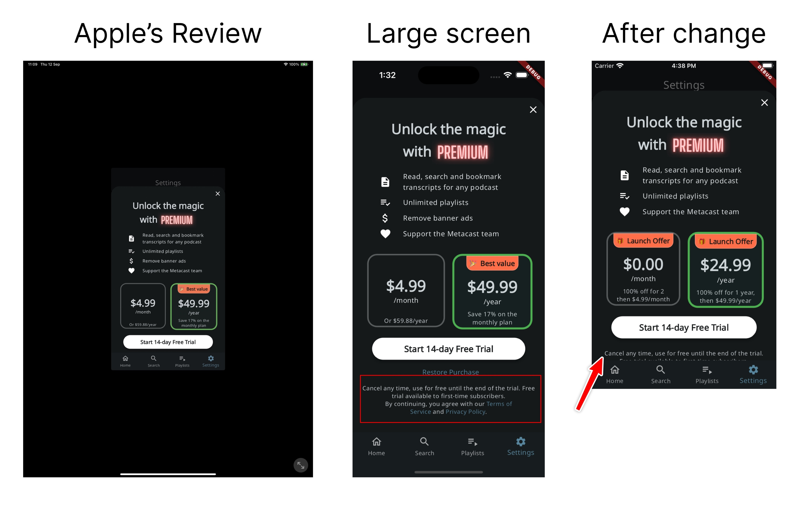</a>

**Issue:** The developer believes Apple rejected the app because the terms links were out of view (guideline 3.1.2). The links fit on the large phone used in development, but not in the smaller window the iPad uses for an iPhone app.

**Change:** The developer changed the layout so the beginning of the terms appears at the bottom, suggesting more content below. They also changed the benefits and launch-offer wording.

**Lesson:** Check that customers can find and open the terms on small screens. Showing the first line helps people notice more content, but they still need to scroll to working links.

**Outcome:** The developer says the app launched on 2024-09-20 after several fixes. The revised screenshot still appears to show an annual price that conflicts with its claim of a 100% discount.

**Source:** [Ilya Bezdelev's Metacast developer blog](https://metacast.app/blog/company/case-study-google-play-apple-app-store-launch), 2024-10-07.

## Other rejection accounts

### notJust.dev: trial copy and metadata are different surfaces

**Issue:** The developer says Apple rejected the App Store listing because it lacked terms links. The paywall already showed terms and privacy links, but those links do not automatically appear in the store listing.

**Change:** The developer says they corrected the listing's links. They did not share screenshots of the revised listing or show a change to the paywall.

**Lesson:** Check the store listing and the app separately. Customers should be able to read the agreement before installing and again before paying.

**Outcome:** The developer reports acceptance but does not identify whether this screenshot shows the accepted version. The weekly trial button omits the trial length, and we do not see the screen with annual selected.

**Source:** [Vadim Savin's developer newsletter](https://news.notjust.dev/posts/my-first-from-app-dev), retrieved 2026-10-06; publication date unconfirmed.

### RadTrack: paywall versus the actual transaction

<a href="images/trial-mismatch.webp">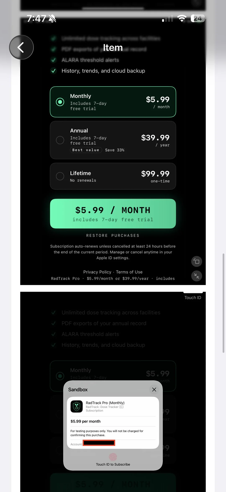</a>

**Issue:** RadTrack promised a seven-day free trial, but Apple's test purchase screen showed $5.99 per month without a trial. The reviewer flagged the missing trial and unclear wording about automatic charges.

**Change:** The developer says they fixed the problem but does not explain the fix or show a corrected screen. We cannot tell what they changed.

**Lesson:** Check that the customer qualifies for the trial and that Apple's purchase screen matches the app's promise. Explain when charging starts and how much the subscription costs when it renews.

**Outcome:** The developer later said Apple had approved the app but still rejected its subscriptions. They did not explain what caused the missing trial. [Full case](cases.md#case-5-radtracks-custom-screen-promised-a-trial-the-system-sheet-omitted).

**Source:** [u/manison88's RadTrack post](https://www.reddit.com/r/appledevelopers/comments/1ti60zi/frustrating_subscription_rejection_reasonadvice/), 2026-05-20; two screens in one flow, not a redesign.

### Unnamed homework app: a trial switch also changes the package

<a href="images/study-toggle.webp">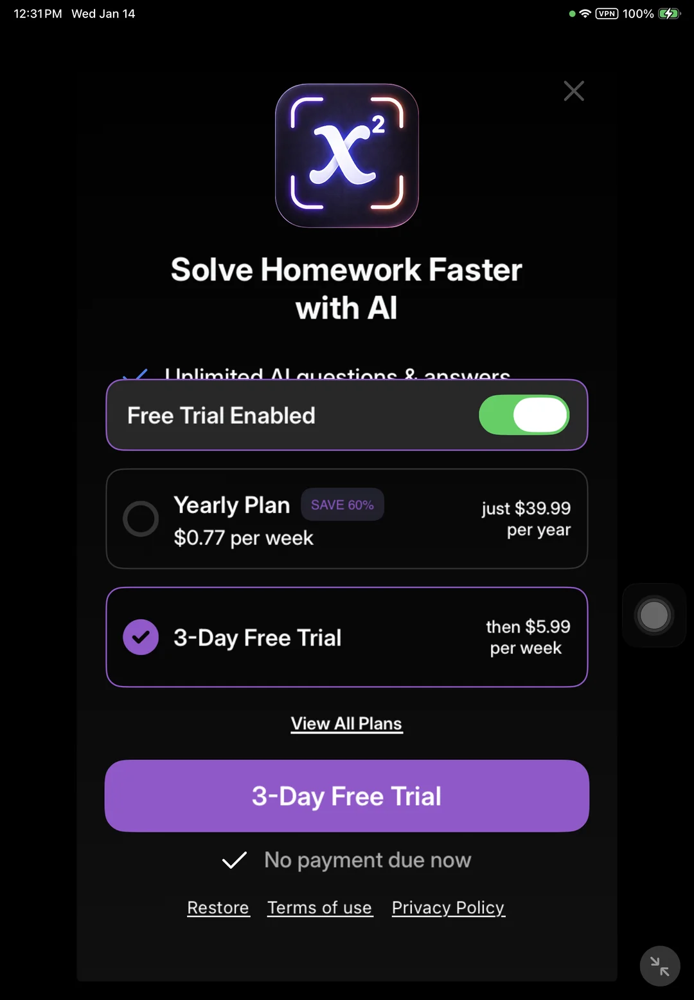</a>

**Issue:** The developer says the switch selected an annual plan when off and a weekly plan with a trial when on. Apple's reviewer called the trial switch confusing (guideline 3.1.2).

**Change:** The developer says they removed the switch and resubmitted the app. They did not share the revised screen.

**Lesson:** Let customers compare each plan's trial length, later charge, and billing period. Turning on a trial should not quietly change the subscription from annual to weekly.

**Outcome:** The developer does not give a final decision in this post. We only have the rejected screen. [Full case and conflicting reports](cases.md#case-2-an-unnamed-homework-apps-trial-switch-changed-the-plan).

**Source:** [u/Usual-Ant305's developer post](https://www.reddit.com/r/AppStoreOptimization/comments/1qeavxq/anyone_else_having_apple_reject_their_app_because/), 2026-01-16; app unnamed.

### Reviewer message: the requested change can be specific

<a href="images/axel-rejection.webp">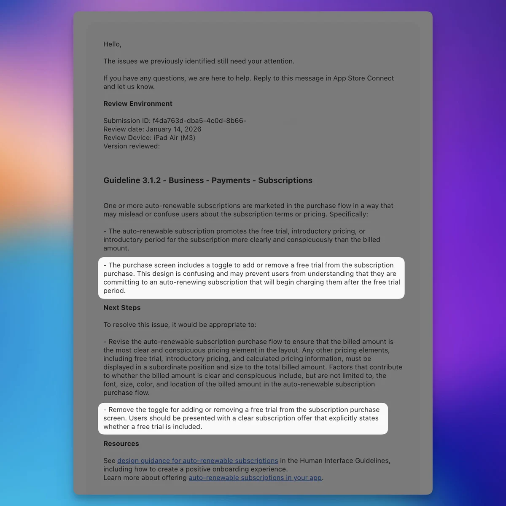</a>

**Issue:** The reviewer said the screen emphasized the introductory offer more than the full subscription charge. They also said the trial switch made the subscription commitment unclear.

**Change:** The reviewer asked the developer to remove the switch and make the full charge easier to see through its font, size, color, and position.

**Lesson:** Show customers how much they will pay and what they are signing up for. More fine print may not help if the offer still draws attention away from the charge or the switch still confuses the choice.

**Outcome:** The post includes no revised screen or final result. This message records one reviewer's request; it does not establish a general rule banning trial switches. [Full case](cases.md#case-3-axel-le-pennec-shared-the-actual-toggle-objection).

**Source:** [Axel Le Pennec on X](https://x.com/alpennec/status/2012188049728520514), 2026-01-16; notice dated 2026-01-14, app unnamed.

## Experiments and other design references

### Foodnoms: feature matrix to trial timeline

| Earlier design | Onboarding experiment |
| --- | --- |
| <a href="images/foodnoms-before.png">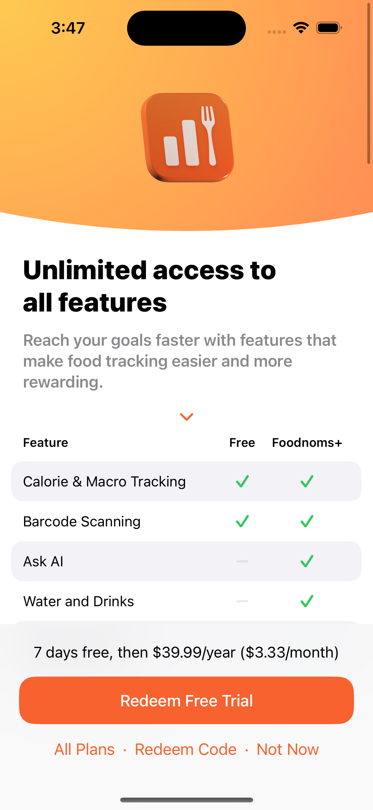</a> | <a href="images/foodnoms-after.png">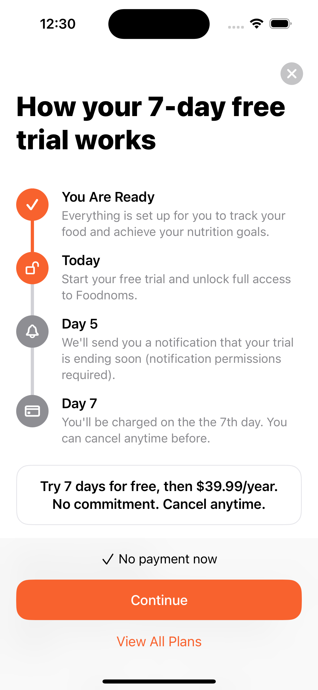</a> |

**Issue:** Customers need to know when the trial ends and charging begins. The earlier screen compared free and paid features, while the experiment focused on explaining the trial's schedule.

**Change:** The new screen lays out the seven-day trial: access now, a reminder on day five if the customer grants permission, and charging on day seven. Both screens show $39.99 per year after the trial.

**Lesson:** Explain trial timing as well as paid features. Only promise a trial to customers who qualify, and tell them what permission the reminder needs.

**Outcome:** After a two-week experiment, the developer reports that the paying-customer conversion rate (the share of users who made a payment) was 59.6% higher than control. The trial-to-paid conversion rate (the share of trial users who became paid subscribers) was 15.9% lower. Both changes are relative to control, not percentage-point changes. More users could therefore reach payment even though a smaller share of trial users continued. The cohorts were still progressing through trials and renewals, so the results could change. These figures do not measure customers' understanding of the offer or establish an App Review outcome.

**Source:** [Foodnoms developer's experiment report](https://ryanwesley.com/paywall-optimization-success-story/), 2024-07-25.

### Dark Noise: revealing all plans up front

<a href="images/dark-noise-options.png">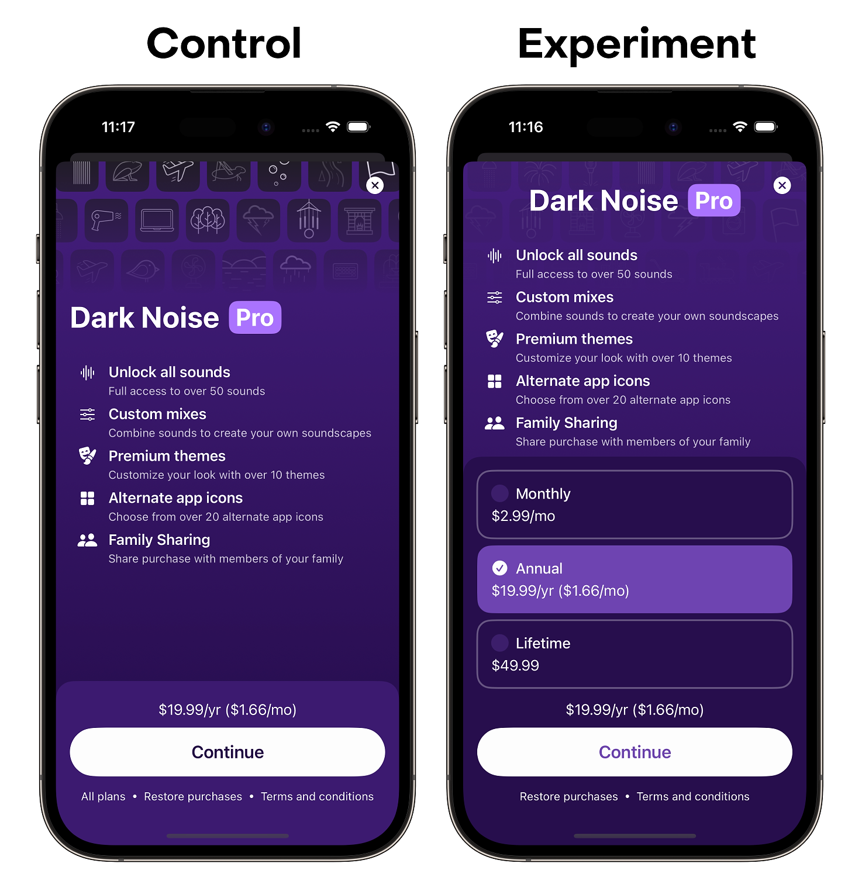</a>

**Issue:** The original screen showed only the annual plan. Customers had to open All plans to find the monthly and lifetime options.

**Change:** The developer tested a screen that shows all three plans together: $2.99 per month, $19.99 per year, and $49.99 for lifetime access. Annual remains selected.

**Lesson:** Show the available plans where customers can compare them, while leaving enough room to read each option. Explain that lifetime access requires one payment rather than recurring charges.

**Outcome:** The developer reports a higher initial signup rate and a shift toward monthly and lifetime plans, with fewer annual signups. They also report higher churn (customers ending their subscriptions), which they attribute partly to the larger share of monthly subscribers. Annual subscribers had not yet reached their first renewal, so the longer-term payment comparison remained incomplete. The result does not establish that showing all plans made the screen harder to use; the article gives no App Review decision for either design.

**Source:** [Charlie Chapman on RevenueCat](https://www.revenuecat.com/blog/engineering/how-i-successfully-migrated-my-indie-app-to-revenuecat-paywalls), 2024-01-03, updated 2025-11-21; the developer also works for the publisher.

### Flo: old and new trial selection

<a href="images/flo-options.webp">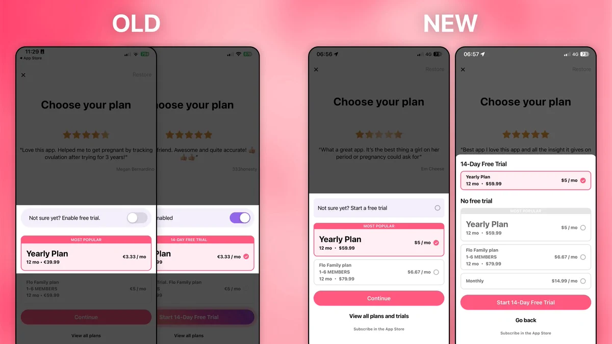</a>

**Issue:** The old design used a switch to enable a trial. Customers had to work out how that switch affected the plan they would buy and the charge after the trial.

**Change:** The new design replaces the switch with a screen that separates plans with a 14-day trial from plans without one. The purchase button names the selected trial duration.

**Lesson:** Show the trial and later charge together for each plan. The new screen still gives the monthly equivalent more attention than the full annual charge, so check [billed-price prominence](https://developer.apple.com/app-store/subscriptions/) too.

**Outcome:** The source does not show that Apple approved these screens. Flo is a separate example, not the revised version of Axel's unnamed rejected app. [Full case](cases.md#case-4-flos-replacement-is-a-design-observation-not-an-approval-record).

**Source:** [Axel Le Pennec's Flo post](https://x.com/alpennec/status/2047218943333482976), 2026-04-23; old/new captures use different prices and £/$ currencies.

### Melonote: a trial timeline on a small screen

| Current design supplied by author | Proposed timeline | Proposed design on iPhone SE |
| --- | --- | --- |
| <a href="images/trial-refunds-before.png">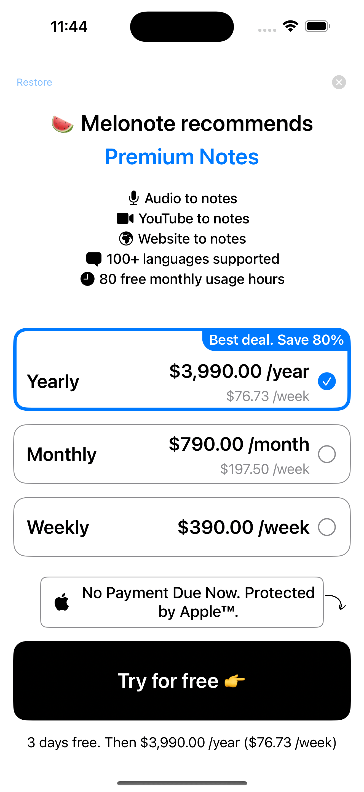</a> | <a href="images/trial-refunds-proposed.png">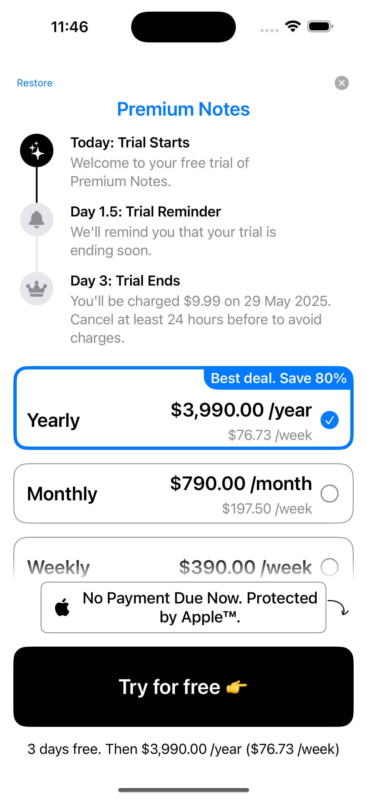</a> | <a href="images/trial-refunds-small-screen.png">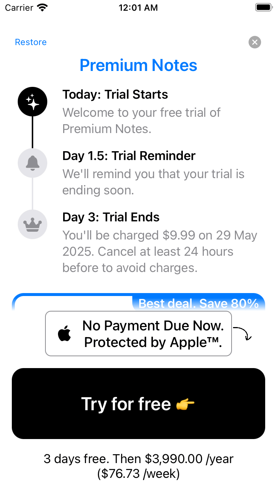</a> |

**Issue:** The developer wanted to reduce refunds by explaining the trial and charge date. That explanation also needs to leave room for customers to choose a plan on small screens.

**Change:** The developer proposed a timeline showing the trial start, reminder, and charge date. They used fictional test prices, so the different amounts in the timeline and plan cards are placeholders.

**Lesson:** Make the charge date clear and deliver the reminder you promise. On the iPhone SE, the fixed footer hides most plan cards, so check that customers can still scroll to and select them.

**Outcome:** The post includes no refund measurements or App Review decision. The protection text carrying Apple's name comes from the app itself and does not show Apple's endorsement.

**Source:** [u/yccheok's Melonote feedback request](https://www.reddit.com/r/UXDesign/comments/1kvy27i/feedback_request_upcoming_paywall_design/), 2025-05-26; current/proposed layouts and iPhone SE comparison.

### ShotZen: a badge change moves the purchase area

<a href="images/shotzen-regression.png">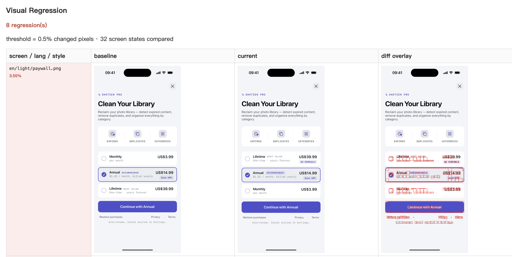</a>

**Issue:** A badge change also moved the purchase button and the links below it. The developer compared screenshots to find changes outside the badge itself.

**Change:** The revised screen puts lifetime first but keeps annual selected. The developer says extra space around the badge moved the button and footer by five pixels.

**Lesson:** After a visual edit, check the selected plan, purchase button, restore option, and terms links. Counting changed pixels tells you how much an image changed, not whether customers can use the screen easily.

**Outcome:** The developer later reduced the visual changes but did not share the resulting screen. The report covers 32 screen states, while this image shows one. The post gives no review decision or sales result.

**Source:** [changyou / MufengLabs on Substack](https://changyou.substack.com/p/a-small-badge-shifted-my-ios-paywall), 2026-09-08, describing September 5 work.

### Headway: what happens after declining the paywall

<a href="images/headway-discount-2024.png">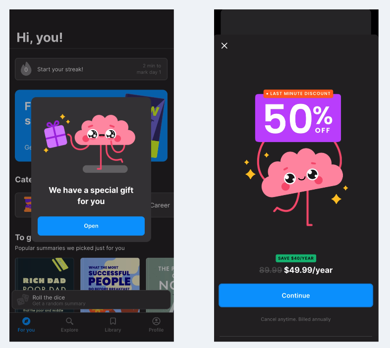</a>

<a href="images/headway-exit-offer.png">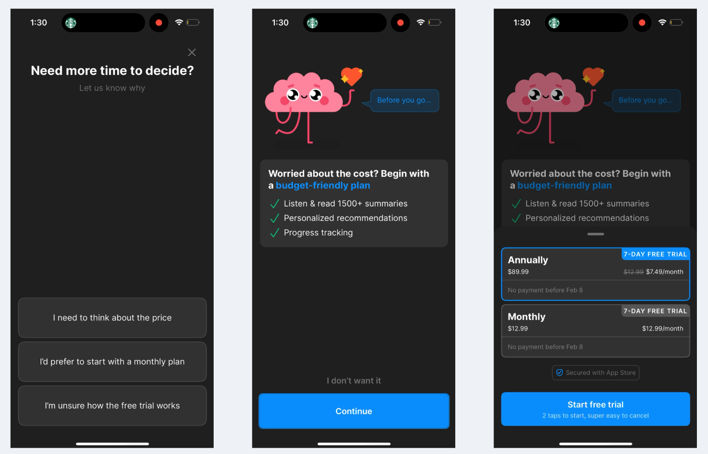</a>

**Issue:** In the 2025 capture, Headway follows a declined offer with a survey and more offers. Customers then need to understand the new terms and find their way out of the flow.

**Change:** The 2024 capture shows a gift and discounted annual purchase without a stated trial. In 2025, answering that price was the concern leads to annual and monthly offers with trials.

**Lesson:** Use a follow-up offer to address the customer's concern, while keeping its terms and exit clear. Only say a discount will disappear if that deadline is real.

**Outcome:** The observer says the app warned that the discount would disappear, yet they found it again later. They explored one survey answer and had no internal experiment results or App Review decision.

**Source:** [Jacob Rushfinn's Retention.Blog newsletter](https://www.retention.blog/p/headway-evolution-2024-2025), 2025-02-03; an outside observer's January 2024/2025 captures.

### Substack: plan choice versus payment route

<a href="images/substack-payment-options.png">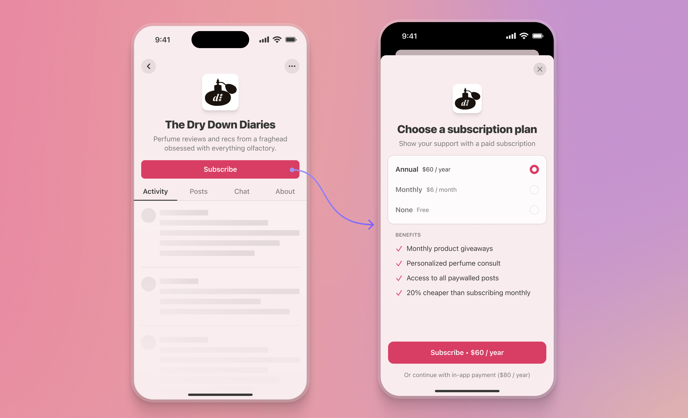</a>

**Issue:** Customers choose both a subscription plan and a way to pay. The same annual subscription shows different prices depending on the checkout method.

**Change:** The illustrated screen offers annual, monthly, and free plans. For annual, the main purchase button shows $60 per year and a less noticeable in-app payment option shows $80 per year.

**Lesson:** Keep the plan and payment method distinct, and show the total charge for each method before customers proceed. Check [current payment rules](README.md#storefront-and-policy-dates-matter) before using this route.

**Outcome:** Substack announced this US flow in 2025 but did not share an App Review decision for these screens. The prices apply to The Dry Down Diaries, not every Substack publication.

**Source:** [Substack's own product newsletter](https://on.substack.com/p/now-anyone-can-pay-for-a-substack), 2025-08-18; product artwork, not a tested checkout.

### WatchFrame: a native plan picker with ambiguous free copy

<a href="images/watchframe-paywall.jpg">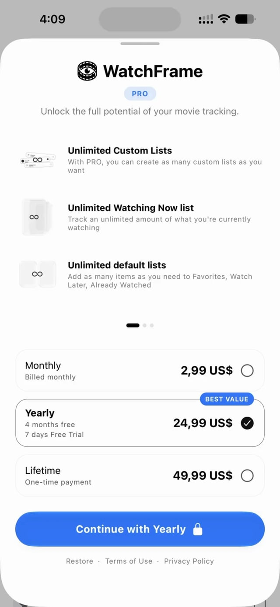</a>

**Issue:** The annual card says four months free beside a seven-day trial. Customers could mistake the annual discount for four months without charges.

**Change:** The current screen lists paid features and monthly, yearly, and lifetime plans. It names the selected yearly plan in the purchase button and describes lifetime as one payment. The post includes no revised wording.

**Lesson:** Explain trial length separately from the savings of annual versus monthly billing. Name the paid features and make the purchase button match the selected plan.

**Outcome:** The developer acknowledges the confusing wording and plans to change it. The post gives no sales or review results, and the video poster shows only one screen.

**Source:** [u/pesekeme's WatchFrame post](https://www.reddit.com/r/iOSDevelopment/comments/1vixwb9/spent_a_week_making_my_paywall_feel_less_like_a/), 2026-08-08 UTC; video poster with US$ prices.

## Compare patterns without treating them as approved templates

Similar-looking symptoms can concern different parts of the purchase. The comparisons below are our interpretation of the cases: they help choose the next check, rather than rank screens by approval or sales.

| Compare | What becomes clearer | Next check |
| --- | --- | --- |
| Metacast and notJust.dev both face objections about terms | Metacast's layout hid in-app links; notJust.dev needed links in the listing. A footer change addresses only the first location. | Identify where the notice says information is missing, then verify the links there. |
| The homework app's trial switch and Flo's separate choices | A control can obscure both trial selection and the billing period. Flo illustrates another way to present choices, without documenting an approval. | Check the plan, trial, and later charge after every selection; answer a reviewer's specific instruction separately from adopting a visual example. |
| RadTrack's missing trial and Foodnoms' trial timeline | Agreement with the actual purchase and explanation of its schedule are separate tasks. A timeline cannot repair an offer the customer will not receive. | Match the app to the system sheet first; then test trial dates, eligibility, and any promised reminder. |
| Dark Noise's plan experiment and WatchFrame's savings wording | Making more options visible changes what people choose; making each option understandable requires clear charges and trial terms. More signups alone cannot demonstrate clearer choices. | Inspect each commitment, then compare payments and cancellations by plan over a suitable follow-up period. |
| Metacast's small window, Melonote's fixed footer, and ShotZen's shifted controls | The same footer can become difficult to reach because of window size, surrounding content, or a later visual edit. A screenshot difference alone does not establish usability. | Open links and select plans on small layouts after changes, rather than checking only whether the text exists. |

See [image provenance](images/README.md) for asset URLs, acquisition details, dimensions, and ownership attribution.
