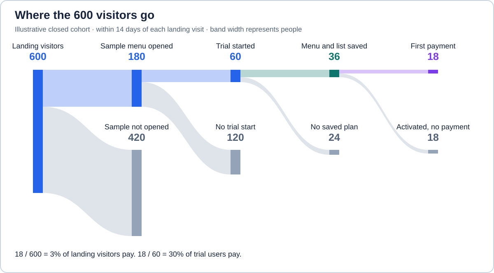
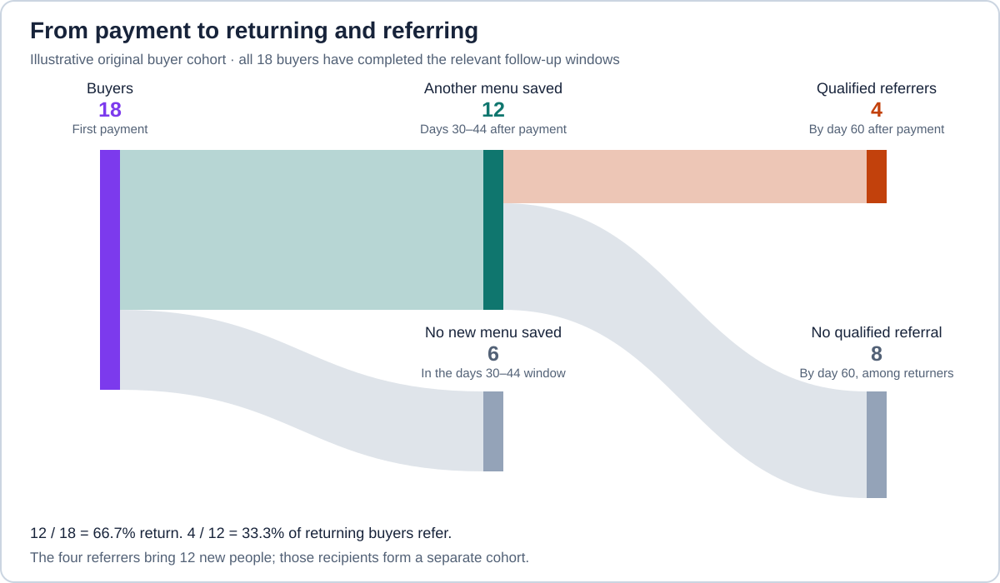
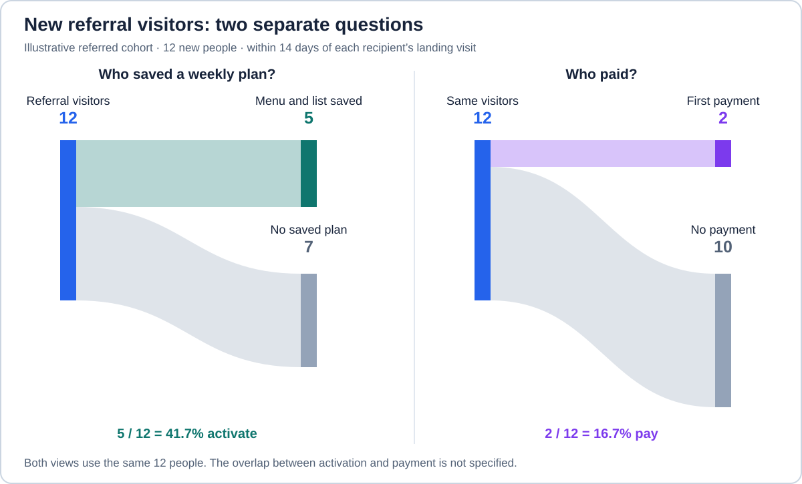

# Marketing funnel for a small indie product

A person can discover a product, try it, and leave before it solves their problem. Another person may get a useful result, pay, and return when the task comes up again. A marketing funnel helps follow these journeys and investigate what makes the next step possible. This guide follows a meal-planning app from discovery through payment, repeat use, and referral, then considers how to choose an improvement.

## Follow one person from a problem to a useful result

Consider a fictional meal-planning app for busy parents who want to spend less time deciding what to cook. It helps them choose dinners for the week and combines the ingredients into a grocery list. The product, counts, and proposed changes throughout this guide are illustrative; they are not measured results or conversion benchmarks.

A parent searches for quick weekday dinners and finds the app's website. They open a sample menu: pasta on Monday, vegetable curry on Tuesday, and other dinners for the rest of the week, with recipes and a grocery list. Seeing how the meals fit together gives them a reason to explore the app before creating an account.

The next question is whether it will work for their household. The parent checks the kinds of recipes offered and the subscription price, then starts a free trial. They choose meals their family likes and save a weekly menu with its grocery list. Call that **activation**: the first useful result from the product. They now have a plan they can shop from, instead of having to choose each dinner from scratch. Creating an account alone would leave that work unfinished.

If the plan is worth the price, the parent may subscribe for more weekly menus. They may later return to plan another week and recommend the app to a friend who also struggles to decide what to cook. Saving a menu gives us an observable result to count; it does not tell us whether the family cooked the meals or enjoyed them.

The stages name the questions and actions along that journey:

| Stage | What the person is deciding | Observable action in this example |
| --- | --- | --- |
| Awareness | Can planning dinners take less effort? | Find the app and visit its website. |
| Interest | Does this look useful enough to explore? | Open the sample menu. |
| Consideration | Will the meals suit my household, at an acceptable price? | Check recipes and price, then start a trial. |
| Conversion | Is the result worth paying for? | Complete the first subscription payment. |
| Retention | Does it help with another week's dinners? | Return and save another weekly menu with its grocery list. |
| Referral | Would this help someone else? | Recommend it and bring a new visitor. |

An action gives some evidence about a person's progress, but leaves their reasoning partly unknown. A pricing-page visit, for example, cannot establish that they understood the price. Voluntary customer conversations can help explain why they continued or stopped.

The stages also allow for different paths. Someone arriving through a friend's recommendation might already know what the app does and subscribe without opening the sample menu. As [HubSpot's marketing-funnel overview](https://blog.hubspot.com/marketing/i-took-a-deep-dive-into-the-marketing-funnel-heres-what-i-learned) explains, buyers can skip stages or return later. To measure one path through the product, we need to say which actions it includes and how long people have to complete them.

## Find where people stop before paying

If few visitors become buyers, the payment total alone gives little guidance about what to change. People might leave before opening the sample menu, struggle to put together meals they like, or save a useful plan and decide against subscribing. Following those steps separately helps narrow the investigation to a particular part of the product.

Start with a **cohort**: a group of people who enter during a defined period and whose progress we follow. Here, 600 distinct people visit the landing page during one week. Their identities are consistently linked across the subsequent actions, and each has completed a full 14-day observation window after their own landing visit.

Within that window, 180 open the sample menu, 60 of those people start a trial, and 18 trial users pay. During the trial, 36 save a weekly menu with its grocery list, including all 18 buyers before they pay. This is a **closed funnel**: people enter at the landing visit and qualify for later steps by completing the required earlier actions in order.

Of the 180 people who open the sample menu, 60 start a trial and 120 do not. Of the 60 trial users, 36 save their own plan and 24 do not. These groups raise different questions: whether the sample makes the app worth trying, and whether the trial helps someone finish planning a week's dinners.

A rate expresses the size of one group relative to the people eligible to reach it:

| Transition | Calculation | Rate |
| --- | --- | --- |
| Landing visit → sample menu opened | `180 / 600` | 30% |
| Sample menu opened → trial start | `60 / 180` | About 33.3% |
| Trial start → first payment | `18 / 60` | 30% |

Across the whole path, `18 / 600 = 3%` of landing visitors become buyers. Among trial users, `18 / 60 = 30%` become buyers. Both describe the same 18 payments, but answer different questions: how often a visit leads to payment, and how often a trial leads to payment.

Looking inside the trial adds another distinction. Activation is `36 / 60 = 60%`, while payment among activated trial users is `18 / 36 = 50%`. The 24 people without a saved menu have not yet reached the result that could give them a reason to pay. Their experience is one possible place to investigate; the counts alone do not explain what stopped them.

## Check whether buyers return and bring others

The first payment tells us someone chose to subscribe. It leaves two questions unanswered: does the app keep helping them plan dinners, and do they recommend it to other parents? Repeat use helps investigate the first question; referral helps investigate the second. These matter when deciding how to support existing customers and how new customers might discover the app.

For this example, 12 of the 18 buyers save another weekly menu with its grocery list during days 30–44 after their own first payment. All 18 have reached the end of that window, so each has had the same opportunity to qualify.

After returning, four of those 12 buyers bring a new visitor through a referral link by day 60 after payment. All 12 have completed that follow-up window too. A **qualified referral** here means that a new recipient actually visits; clicking a share button alone does not qualify.

Repeat use is `12 / 18`, about 66.7%, and referral among returning buyers is `4 / 12`, about 33.3%. The second denominator is the 12 returners because this worksheet follows referral after repeat use. Customers who recommend the app before returning would need a separate path.

The six buyers who did not save another menu during days 30–44 may have reused earlier recipes, been away from home, or found planning with the app too much work. Those possibilities suggest different responses. If choosing a new menu is tedious, saved preferences might help; if an earlier menu still meets their needs, a reminder to make another one may accomplish little. Choose a window that fits how people plan meals and compare groups whose full follow-up windows have elapsed. Subscription renewal and saving another useful plan are separate measurements.

The four referrals raise a different question: can a customer help someone else find a useful solution? Sharing the sample menu might give a friend a clearer idea of the app than sending its name alone. The value of that recommendation depends on what the friend does next, so we follow the new visitors as well as the customers who brought them.

### Check whether referrals lead to useful results

A recommendation brings someone to the app, but they still need to find meals that suit their household. Following referred visitors tells us whether this route leads to saved plans and subscriptions. If people arrive but cannot get a result, increasing the number of invitations could bring more people to the same difficulty.

The four referrers bring 12 new visitors in total. These recipients begin their own journeys; they are not a further subset of the original 600. Give each recipient a new 14-day window starting at their own landing visit. All 12 have completed that window, during which five activate and two pay.

Among these 12 visitors, activation is `5 / 12`, about 41.7%, and visitor-to-buyer conversion is `2 / 12`, about 16.7%. The worksheet does not say which activated recipients paid, so it cannot establish a payment rate among activated recipients.

These visitors arrived through a different route from the original cohort. Their payment rate can prompt questions about who was referred and what they already knew, but two payments are too little evidence to treat that route as reliably better. The counts also do not show that a recommendation caused a purchase or that a referral incentive would pay for itself.

## Choose where to investigate

We now have several possible investigations: what prevents visitors from opening the sample menu, what stops trial users from getting a result, whether buyers need the app again, and what happens to people they refer. Connecting these questions to the six stages in the [opening stage table](#follow-one-person-from-a-problem-to-a-useful-result) helps choose where to focus:

The sample menu gives a visitor a way to judge whether the app is worth exploring. The trial lets them choose meals for their household, and saving a plan gives them something to shop from. Conversion, retention, and referral then ask successive questions about paying for more plans, planning another week, and recommending the app to someone else. Each stage points to a different part of the experience to investigate.

Of the 600 visitors, 420 did not open the sample menu. It is the largest loss in the example, but its size says little about the cause. Some visitors may want a single recipe rather than a weekly plan; others may not see how to begin. Further along, 24 trial users do not save a menu. They have already started a trial, which narrows the question to what happens while they choose meals and put together their plan.

Referral connects useful product use with someone else's discovery: four customers bring 12 new visitors, who begin their own journeys at awareness. These counts show how customers can bring others to the product, but do not establish a self-sustaining growth loop.

The 24 trial users without a saved menu give us a concrete question to investigate: what prevented them from finishing their plan? First, check whether the count matches their experience. A missing record could mean that the menu was never saved, or that it was saved without the action being recorded. Those explanations lead to different work.

## Check whether the apparent drop-off is real

An analytics report follows the actions it records and the sequence configured for them. Suppose someone who already knows the app visits the landing page, skips the sample menu, starts a trial, and pays. If the report requires opening the sample, that person can disappear from later steps despite making a payment. The apparent drop-off would partly reflect the chosen path rather than a failed purchase.

[Google Analytics funnel exploration](https://support.google.com/analytics/answer/9327974) allows **open funnels**, where people can enter at a later step, as well as closed funnels. Both still require subsequent steps in the configured order. Check the required actions, whether other actions may occur between them, and any step time limits when reconciling a report with what customers did.

The unit being counted matters too. One person saving five menus contributes five save events but only one activated user. A household account may have several users and one payer. The worksheet counts distinct people, so its rates require a consistent way to recognize the same person across steps.

For a small product, a spreadsheet with consistently defined counts may be enough to start. If using analytics, follow a test account through the actions and check that the records appear as expected. Reconcile payments with the payment system. [GA4 key events](https://support.google.com/analytics/answer/9267568) identify actions important to a business; the underlying action still needs to represent the useful result being investigated.

The same care applies to discovery. Impressions and clicks can help inspect an acquisition channel, but one person may generate many of them. Keep them separate from the visitor cohort, record how visitors are assigned to channels, and note gaps caused by consent, anonymous visits, or cross-device use. Collect the event data needed for the question without including private household notes.

## Choose a change from the cause

Once the count reflects 24 trials without a saved plan, check for errors when saving and ask willing users where they got stuck. The aim is to find a problem that a change can address. Someone who likes most of the meals but cannot replace one dinner needs different help from someone who finds none of the recipes appealing.

Suppose the investigation finds that parents abandon a suggested menu when it includes a dinner their family dislikes. They can replace it, but the option is hidden in a settings screen. Put a “Replace this dinner” button beside each meal and show alternatives there. A parent who dislikes Tuesday's curry could choose fried rice instead, keep the rest of the week, and save the updated menu and grocery list. The proposed change addresses the difficulty found in the investigation.

A finding at another stage would suggest different work:

| Where people stop | Possible finding | A change matched to that finding |
| --- | --- | --- |
| Discovery | Visitors want a single recipe rather than a weekly plan. | Explain the app's purpose where people look for help planning a week. |
| Sample | The sample menu is hidden behind signup. | Show the meals and grocery list before asking someone to start a trial. |
| Trial | People cannot find how to replace a dinner they dislike. | Put the replacement action beside each meal. |
| Payment | Checkout fails or the recurring price is unclear. | Fix verified errors and explain the total price. |
| Repeat use | People must enter the same household preferences every week. | Save those preferences and let people adjust them. |
| Referral | A shared link gives the friend little idea of what the app offers. | Link to a sample weekly menu they can view without an account. |

For the dinner-replacement change, compare later cohorts using the same actions, identity rules, and observation windows. Set a review date and a criterion for keeping the change before examining the results. Track activation alongside paid conversion, refunds, support time, and repeat use so that an improvement in one step does not hide a problem elsewhere. With small groups, report raw counts as well as rates; a before-and-after difference alone does not establish that the change caused it.

The funnel helps decide where to investigate and whether a proposed change merits further testing. If acquiring visitors costs money, also compare that cost with what customers contribute after relevant costs and refunds. Keep an assumed lifetime value distinct from measured customer revenue and costs when deciding how much to spend.

[Back to Indie Hacking](../README.md)

## Sources

- [HubSpot: Stages of the marketing funnel](https://blog.hubspot.com/marketing/i-took-a-deep-dive-into-the-marketing-funnel-heres-what-i-learned) — the stage framework and nonlinear customer journeys.
- [Google Analytics: Funnel exploration](https://support.google.com/analytics/answer/9327974) — entry, sequence, and timing rules for measured funnels.
- [Google Analytics: About key events](https://support.google.com/analytics/answer/9267568) — how important measured actions are identified. The meal-planning product and worksheet are original illustrative applications.
